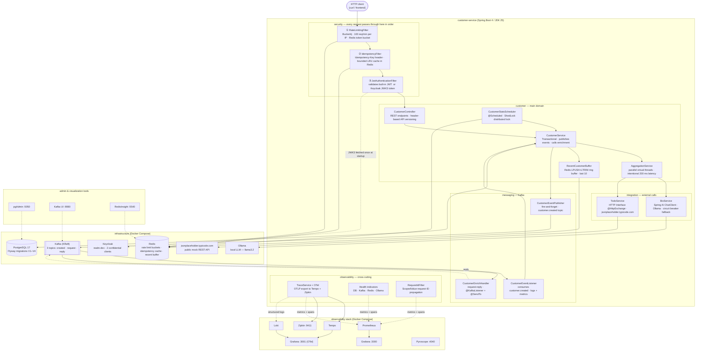

# Spring Boot 4 – Observable Customer Service

This project has one goal: demonstrate what it takes to diagnose an incident on a backend service.
The stack is built around that scenario — not around the technologies themselves.

## Table of contents

- [Architecture](#architecture)
- [Quick start](#quick-start)
- [What this demonstrates](#what-this-demonstrates)
- [Running locally](#running-locally)
- [Screenshots](#screenshots)
- [Detailed documentation](#detailed-documentation)

---

## Architecture



---

## Quick start

```bash
# Start everything (Docker + observability + app)
./run.sh all

# Or step by step:
docker compose up -d              # infra (DB, Kafka, Redis, Ollama, Keycloak, admin tools)
./run.sh obs                      # observability (Grafana, Prometheus, Tempo, Zipkin, Pyroscope)
./run.sh app                      # Spring Boot app

# Get a token
TOKEN=$(curl -s -X POST http://localhost:8080/auth/login \
  -H 'Content-Type: application/json' \
  -d '{"username":"admin","password":"admin"}' | jq -r .token)

# Create a customer (20 demo customers are pre-loaded by Flyway)
curl -s -X POST http://localhost:8080/customers \
  -H "Authorization: Bearer $TOKEN" \
  -H 'Content-Type: application/json' \
  -d '{"name":"Alice","email":"alice@example.com"}'

# Generate traffic for dashboards
./run.sh simulate

# Check status of all services
./run.sh status
```

---

## What this demonstrates

### Core — observability and diagnosis

| Capability | How it's implemented |
|---|---|
| Distributed tracing | OpenTelemetry → Tempo (OTLP) + Zipkin (dual export); DB spans via `datasource-micrometer` |
| Metrics and latency histograms | Micrometer → Prometheus → Grafana (p50/p95/p99, custom counters) |
| Structured logs correlated with traces | OTel log exporter → Loki, trace ID injected in every log line |
| Health probes | Custom indicators for DB, Kafka, Redis, Ollama; liveness/readiness groups |
| Operational endpoints | `/actuator/health/readiness`, `/actuator/prometheus`, Swagger UI |

### Additional patterns

| Pattern | What it illustrates |
|---|---|
| Kafka fire-and-forget + request-reply | Async decoupling vs sync correlation with built-in timeout |
| JWT + optional Keycloak + API key | Three auth modes in one filter chain |
| Resilience4j circuit breaker + retry | Graceful degradation when an external dependency fails |
| Bucket4j rate limiting | Token-bucket per IP, enforced before business logic |
| WebSocket notifications | Real-time push on customer creation via STOMP |
| Cursor pagination + search | Efficient pagination + full-text search on name/email |
| Batch import + CSV export | Bulk operations with streaming response |
| Virtual threads (Project Loom) | Parallel sub-tasks in `AggregationService` |

### Security

| Pattern | What it illustrates |
|---|---|
| OWASP security headers | CSP, X-Frame-Options, nosniff, Referrer-Policy |
| Brute-force protection | IP lockout after 5 failed login attempts (15 min) |
| Input sanitization | `@Size(max=255)`, request body limit (1 MB) |
| Audit logging | DB-backed `audit_event` table — who, what, when, IP |
| SQL injection / XSS demos | Vulnerable vs safe endpoints for education |
| OWASP Dependency-Check | CVE scan on all dependencies |

---

## Running locally

```bash
./run.sh all            # start everything (infra + obs + app)
./run.sh restart        # stop + restart everything (keeps data)
./run.sh stop           # stop app + all containers
./run.sh nuke           # full cleanup — containers, volumes, build artifacts
./run.sh status         # check status of all services
./run.sh simulate       # generate traffic (60 iterations, 2s pause)
./run.sh app-profiled   # start app with Pyroscope profiling

./run.sh test           # unit tests (no Docker)
./run.sh integration    # integration tests (Testcontainers)
./run.sh verify         # lint + unit + integration (mirrors CI)
./run.sh security-check # OWASP Dependency-Check (CVE scan)
```

Pre-push hook (via lefthook) runs unit tests automatically before every `git push`.

### Dashboards

| Dashboard | URL |
|-----------|-----|
| App / Swagger | http://localhost:8080/swagger-ui.html |
| Grafana — HTTP | http://localhost:3000 |
| Grafana — OTel | http://localhost:3001 |
| Prometheus | http://localhost:9090 |
| Zipkin | http://localhost:9411 |
| Pyroscope | http://localhost:4040 |
| pgAdmin | http://localhost:5050 (admin@demo.com / admin) |
| Kafka UI | http://localhost:9080 |
| RedisInsight | http://localhost:5540 |
| Keycloak | http://localhost:9090 (admin / admin) |

---

## Screenshots

### Grafana — HTTP metrics


### Prometheus — raw metrics


### Grafana — OpenTelemetry traces


---

## Detailed documentation

| Document | Content |
|----------|---------|
| [Architecture](docs/architecture.md) | Component reference, call flows, code organisation |
| [API Reference](docs/api.md) | All endpoints with curl examples |
| [Security](docs/security.md) | OWASP patterns, demo scenarios, headers |
| [Observability](docs/observability.md) | Dashboards, diagnostic scenarios, Kafka patterns, resilience |

---

## Spring Boot & Java compatibility

The default build targets **Spring Boot 4.0.5 + Java 25**. Maven profiles enable compilation
and testing against older versions — no code change required.

### Supported combinations

| Command | Spring Boot | Java | Notes |
|---------|-------------|------|-------|
| `mvn verify` | 4.0.5 | 25 | Default — native API versioning, `ScopedValue`, switch pattern matching |
| `mvn verify -Dcompat` | 4.0.5 | 21 | `ScopedValue` replaced by `ThreadLocal` |
| `mvn verify -Dcompat -Djava17` | 4.0.5 | 17 | + switch pattern matching replaced by if/else |
| `mvn verify -Dsb3` | 3.4.5 | 21 | SB3 BOM + `ThreadLocal` + manual header-based API versioning |
| `mvn verify -Dsb3 -Djava17` | 3.4.5 | 17 | SB3 + Java 17 (all compat layers applied) |

### How it works

Source overlays in dedicated directories replace version-specific files at compile time.
The compiler is pointed at a merged copy — no original file is modified.

| Overlay directory | Replaces | Why |
|-------------------|----------|-----|
| `src/main/java-compat/` | `RequestContext`, `RequestIdFilter`, `TraceService` | `ScopedValue` (Java 25) → `ThreadLocal` (Java 17/21) |
| `src/main/java-compat-java17/` | `ApiExceptionHandler` | switch pattern matching (Java 21) → if/else (Java 17) |
| `src/main/java-sb3/` | `CustomerController` | `@GetMapping(version=...)` (Spring 7) → manual `X-API-Version` header dispatch |
| `src/test/java-sb3/` | `AutoConfigureMockMvc` | Bridge annotation: SB4 package → SB3 package |

The `RestTestClient`-based test (`CustomerRestClientITest`) is excluded from SB3 builds
since that class only exists in Spring Framework 7. The `CustomerApiITest` (MockMvc) covers
the same endpoints.

### Maven compatibility

The project supports both **Maven 3.9.x** (default) and **Maven 4.0.x**.

The Maven Wrapper (`./mvnw`) pins the exact version. To switch:

```bash
# Edit .mvn/wrapper/maven-wrapper.properties and uncomment the desired distributionUrl:
#   Maven 3.9.14 (default)
#   Maven 4.0.0-rc-3

# Then verify:
./mvnw --version
```

**Tested with Maven 4.0.0-rc-3** — all 5 profile combinations compile and pass tests.
All plugin versions are resolved via the `spring-boot-starter-parent` `<pluginManagement>`,
which Maven 4 accepts. No unversioned plugins, no deprecated `<prerequisites>` or
`<reporting>` sections. The `maven-antrun-plugin` conditional copies (`xmlns:if="ant:if"`)
use standard Ant features supported by both Maven versions.

---

## CI/CD

| Pipeline | Config | Trigger |
|----------|--------|---------|
| **GitLab CI** | `.gitlab-ci.yml` | MR push + main push |
| **GitHub Actions** | `.github/workflows/ci.yml` | Push + PR |

```bash
./run.sh verify   # local equivalent of the full CI pipeline
```
