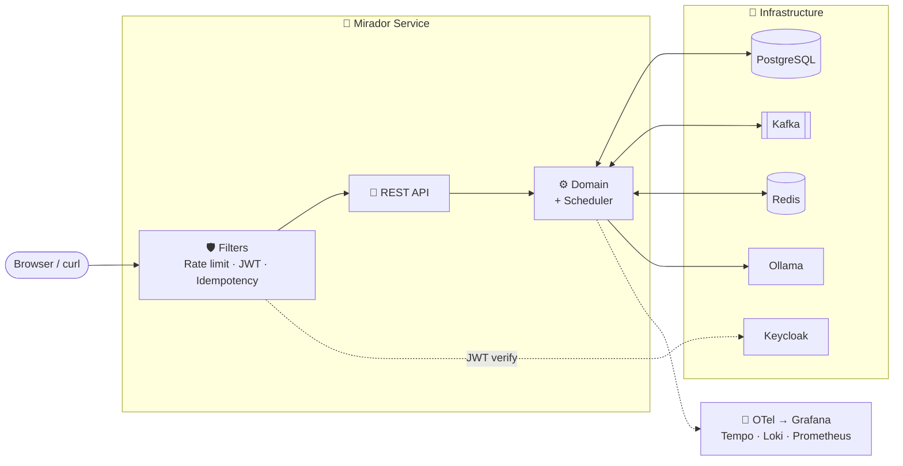

<sub>**English** · [Français](README.fr.md)</sub>

> **What this project demonstrates mastery of**
>
> _A 30-second skim of the central themes of current backend mastery — each axis
> is verified at every `stable-v*` tag. Source of truth for what "this rev guarantees" :
> `git show stable-vX.Y.Z`._
>
> - 🤖 **IA** — Spring AI 1.1.4 + Ollama local LLM (llama3.2) + 14 in-process MCP tools (per-method `@Tool` annotations, ADR-0062) + claude-compatible streamable-http transport (`spring.ai.mcp.server.protocol=STREAMABLE`) + AI Observability (`gen_ai.*` OTel spans → Tempo) + audit log per tool call.
> - 🔒 **Sécurité** — JWT HS256 (15 min, refresh-token rotation) + X-API-Key static fallback + OAuth2/OIDC (Auth0 prod / Keycloak dev) + RBAC (`ROLE_ADMIN` / `ROLE_USER`) + Bucket4j rate-limit (100 req/min/IP) + IdempotencyFilter (POST/PATCH) + SecurityHeadersFilter (CSP/HSTS/X-Frame-Options) + per-MR security gates : grype + trivy + cosign sign+verify + dockle + OWASP dependency-check + secret-detection + semgrep-sast — all green.
> - 🧠 **Fonctionnel** — Customer onboarding & enrichment (Spring AI Ollama-driven bio generation, observable with `gen_ai.*` spans) + Order / Product / OrderLine domain (6 invariants enforced via `jqwik` property tests, JaCoCo per-package gates) + Chaos Mesh diagnostic endpoints (`/customers/diagnostic/{slow-query, db-failure, kafka-timeout}`).
> - ☁️ **Infrastructure & Cloud** — GKE production cluster `mirador-prod` (europe-west1) + Terraform IaC + multi-cloud deploy targets (AKS, EKS, Cloud Run, Fly.io — manual jobs in CI) + cert-manager + ingress-nginx + Argo CD GitOps + ephemeral pattern (ADR-0022) targeting ≤ €2/month idle + Workload Identity Federation (no service account JSON keys) + budget alerts via `bin/budget/budget.sh`.
> - 📊 **Observabilité** — OpenTelemetry traces + logs + metrics → LGTM stack (Tempo / Loki / Mimir / Grafana) + 3 SLOs as code via Sloth (availability / latency / enrichment) + multi-burn-rate alerting + 4 dashboards (SLO overview, Apdex, latency heatmap, SLO breakdown by endpoint) + chaos-driven SLO demo annotations + 3 runbooks (slo-availability, slo-latency, slo-enrichment) + monthly review cadence doc.
> - ✅ **Qualité** — JaCoCo merged unit+IT coverage 70 % gate + per-package gates on `com.mirador.{order,product}` + PIT mutation testing + SonarCloud quality gate + Spectral OpenAPI 3.1 lint + hadolint + Checkstyle + SpotBugs + findsecbugs + jqwik property-based tests + Testcontainers integration tests (Postgres + Kafka + Redis).
> - 🔄 **CI/CD** — GitLab CI 19+ jobs across `lint / test / integration / k8s / package / sonar / native / compat / deploy` stages + compat matrix SB3/SB4 × Java17/21/25 (5 combos) + Conventional Commits enforced (Lefthook + commitlint) + auto-merge with `--remove-source-branch=false` + cosign sign+verify + SBOM (syft) + Renovate weekly dependency bumps + workflow `changes:` allowlist.
> - 🏛 **Architecture** — Hexagonal Lite (ADR-0044, `port/` only when cross-feature coupling emerges) + Feature-slicing (ADR-0008, `com.mirador.{customer, order, product, mcp, …}`) + polyrepo flat α submodules (ADR-0060) + per-method MCP `@Tool` exposure (ADR-0062, "produces vs accesses" rule) + Clean Code 7 non-negotiables (binding, audited at `docs/audit/clean-code-architecture-*.md`) + 60+ Architecture Decision Records.
> - 🛠 **DevX** — Renovate weekly + Lefthook commit-msg + pre-push hooks + `bin/dev/stability-check.sh` comprehensive gate (sectioned) + `./run.sh` dispatcher (28 cases : `app`, `db`, `obs`, `kafka`, `k8s-local`, `clean`, `nuke`, …) + `bin/dev/api-smoke.sh` (Hurl flows) + `bin/budget/*` cost discipline + scheduled tasks for dated TODOs (e.g. mcp-core CVE revisit 2026-05-26) + ADR drift checker + Conventional Commits CI template (shared via `infra/common/`).

<!-- Top-line badges : 8 essentials. Build status + 4 baseline tech + 3
     industrial gates (security, SLO, mutation). The exhaustive tech
     coverage lives in the "Technology coverage" section further down,
     so the head of the README reads as an outcome, not a tech dump. -->
[](https://gitlab.com/mirador1/mirador-service-java/-/pipelines)
[](https://gitlab.com/mirador1/mirador-service-java/-/pipelines)
[](https://sonarcloud.io/project/overview?id=mirador1_mirador-service)


## What this project proves

Mirador is a production-grade Java backend demonstrator focused on industrial software concerns:
- diagnosing incidents through logs, metrics and traces;
- securing APIs with JWT/OIDC, rate limiting and audit logs;
- validating architecture decisions through ADRs;
- running quality gates in GitLab CI;
- showing how a backend can evolve across Java/Spring versions without rewriting the system.

The default branch uses recent versions to explore the future stack.
**A conservative production target would be Java 21 LTS + Spring Boot 3.x** — the compat
matrix in CI proves both stacks build + test green from the same source tree, so a real
rollout would freeze on the LTS pair without any code change.

## TL;DR for hiring managers (60 sec read)

- **Industrial backend pattern** : Customer onboarding pipeline with KYC-style enrichment,
  Kafka-driven audit events, regulatory traceability, and incident diagnostic endpoints — not a CRUD demo.
- **Observability-first** : every layer (HTTP, JVM, DB pool, Kafka, Redis) emits OTel traces +
  metrics + structured logs. **3 SLOs defined-as-code** (Sloth) with multi-window multi-burn-rate
  alerting (Google SRE Workbook) and a Grafana SLO dashboard.
- **Security supply chain** : JWT + refresh-token rotation, OWASP Dep-Check + Trivy + Grype +
  Syft + cosign + SBOM, Kyverno cluster policies, External Secrets Operator over GSM.
- **Quality gates** : SonarCloud + PIT mutation + JaCoCo coverage + Testcontainers ITs +
  Spotless/Checkstyle/SpotBugs/PMD all blocking in CI. ArchUnit enforces hexagonal layering.
- **Resilient operations** : Argo CD GitOps + Argo Rollouts canary, Resilience4j circuit-
  breaker + retry, chaos endpoints, runbook-linked alerts. Cluster lifecycle via Terraform.

# Mirador — the watchtower for a real running system

> **Watch. Understand. Act.**
>
> _Built with the right tools and the right methods._

**Mirador** — Spanish for *watchtower* — is a vantage point. The project
picks a concrete **Customer onboarding & enrichment service** and stands
watch over it from every angle at once : **the code, the runtime metrics,
the CI/CD pipelines, and the industry-standard tooling wired around it**.

The mini-domain is deliberately industrial : a Customer goes through
**registration → validation → external enrichment (JSONPlaceholder + Ollama
LLM) → Kafka audit events → state tracking → incident diagnostic endpoints**
(`/customers/diagnostic/{slow-query,db-failure,kafka-timeout}` for
controlled chaos). It mirrors the shape of a regulated-industry onboarding
flow (KYC, AML, customer 360°) without inheriting the regulatory weight,
so the focus stays on the engineering disciplines.

The same live backend is visible through two complementary "windows" :

- the paired UI ([`mirador-ui`](https://gitlab.com/mirador1/mirador-ui))
  shows it from the **business angle** — REST endpoints, customer data,
  request/response payloads, the UX layer;
- Grafana shows it from the **observability angle** — Prometheus
  metrics, Tempo traces, Loki logs, all flowing through OpenTelemetry.

Both panes look at the exact same `mirador-service-java` instance; nothing
is mocked between them.

This repository is the **Spring Boot 4 / Java 25 backend** (default
branch). The CI compat matrix also builds + tests green on **Java 21 LTS +
Spring Boot 3.x** from the same code — that's the conservative production
target. See [What this proves for a senior backend architect](#what-this-proves-for-a-senior-backend-architect)
below for the recruiter-facing summary.

What the project actually exercises:

- **Reference-grade industrial tooling**: GitLab CI with local runner, Kustomize-over-Helm
  K8s manifests, OpenTelemetry (traces + logs + metrics) to Grafana Cloud, Sonar,
  Semgrep, Trivy / Grype / Syft / cosign / Dockle, OWASP Dependency-Check, PIT mutation
  testing, resilience4j circuit-breakers + bucket4j rate limiting, Flyway, Testcontainers,
  Workload Identity Federation. The "why" for each lives in the ADRs
  + glossaries linked in the [Architecture Decision Records](#architecture-decision-records-adrs--the-canonical-why)
  section above.
- **Live observability of a running system**: every layer (JVM, HTTP, DB pool, Kafka,
  Redis, Tomcat, business counters) emits metrics and traces so the accompanying UI
  (and Grafana) can show what the code and the runtime are actually doing.
- **AI-assisted integration work**: the selection, wiring, and documentation of most
  of this tooling — the ADRs, the technology glossary, the CI hardening, the K8s
  baseline, the observability setup — were produced in close collaboration with an
  LLM, and the same technique keeps the docs, tests, and configuration in sync as
  the system grows.

The original demo scenario ("what does it take to diagnose an incident?") is still
the organising principle — the stack is built around that use case rather than
around the technologies themselves.

### Architecture Decision Records (ADRs) — the canonical "why"

Every non-trivial trade-off in this repo is captured as an Architecture
Decision Record under [`docs/adr/`](docs/adr/) (39 ADRs at last count,
in [Michael Nygard's
format](https://github.com/joelparkerhenderson/architecture-decision-record/blob/main/locales/en/templates/decision-record-template-by-michael-nygard/index.md):
context → decision → consequences). The two glossaries are the matching
"what" reference:

- [`docs/reference/technologies.md`](docs/reference/technologies.md) — every
  tech the backend uses, what it does, why it was picked.
- [`docs/reference/methods-and-techniques.md`](docs/reference/methods-and-techniques.md)
  — the practices (TDD, Conventional Commits, etc.) and the rationale.

When this README references a specific decision inline as `(see
ADR-NNNN)`, the link goes to the full record. The rest of the README
focuses on *what* the project shows; the ADRs answer *why each piece
is here, and what was rejected to get here*.

## Table of contents

- [What this proves for a senior backend architect](#what-this-proves-for-a-senior-backend-architect)
- [Technology coverage](#technology-coverage)
- [Why this, not that — the arbitrages](#why-this-not-that--the-arbitrages)
- [Simplification levers](#simplification-levers)
- [AI-assisted integration — where it contributed, where it didn't](#ai-assisted-integration--where-it-contributed-where-it-didnt)
- [Known limitations](#known-limitations)
- [Architecture — dev (Docker Compose)](#architecture)
- [Architecture — production (Kubernetes)](#architecture--production-kubernetes)
- [Quick start](#quick-start)
- [What this demonstrates](#what-this-demonstrates)
- [Running locally](#running-locally)
- [Local Kubernetes (kind)](#local-kubernetes-kind)
- [CI/CD](#cicd)
- [Screenshots](#screenshots)
- [Detailed documentation](#detailed-documentation)

---

## What this proves for a senior backend architect

| Concern | What this repo demonstrates | Why it matters in production |
|---|---|---|
| **System design** | Hexagonal layering enforced by ArchUnit ; ADRs (39+) document each rejection ; Kafka request-reply pattern with correlation ID + timeout ; Resilience4j circuit-breaker + retry on every external call. | Architecture decisions are reviewable + reversible ; the system is built around use cases, not frameworks. |
| **Security** | JWT (HS256) + refresh-token rotation + jti revocation ; Auth0 + Keycloak both wired ; rate limiting (Bucket4j) ; SAST (Semgrep) + SCA (OWASP Dep-Check + Trivy + Grype) + image signing (cosign) + SBOM (Syft) all blocking in CI. | Defence in depth, supply chain integrity, no "we'll add it later". |
| **Observability** | OTel SDK → Collector → LGTM ; **3 SLOs defined-as-code via Sloth** with multi-window multi-burn-rate alerting (Google SRE Workbook) ; Grafana SLO dashboard tracks error budget consumption. | "Are we within contract this month?" is an objective question with a graph, not a vibe check. |
| **Data + state** | PostgreSQL + Flyway migrations ; Redis ring buffer + cache ; Kafka KRaft with auto-create off in prod ; idempotent consumers ; transactional outbox pattern (see ADR). | State is intentional, migrations are reviewable, replays are possible. |
| **CI/CD discipline** | GitLab CI exclusively (no SaaS quota) ; group-level runner serves 4 repos ; lefthook 3-tier hooks ; conventional-commits enforced ; SonarCloud + JaCoCo + PIT mutation all gated ; multi-arch Docker via buildx. | Quality contracts > reviewer goodwill ; regressions break the build, not the next deploy. |
| **Operations** | Argo CD GitOps ; Argo Rollouts canary ; chaos diagnostic endpoints ; runbook URLs in every alert ; RTO/RPO discussed in SLA doc ; ephemeral cluster (cost-controlled) with budget alerts. | The system is operable, not just deployable. |
| **Evolution** | Compat matrix Java 17/21/25 × SB3/SB4 — same source tree, both stacks build + test green ; ADRs supersede each other rather than rewriting docs ; Renovate auto-bumps with grouped MRs. | Tech evolves without rewrites ; conservative LTS path is always reachable. |
| **Polyrepo coherence** | Sibling repos ([UI](https://gitlab.com/mirador1/mirador-ui), [Python mirror](https://gitlab.com/mirador1/mirador-service-python), [shared infra](https://gitlab.com/mirador1/mirador-service-shared)) share runner + CI templates + observability + ADR cross-references via git submodule. | Demonstrates how to keep multiple services consistent without monorepo lock-in. |

---

## Technology coverage

The badge row at the top is **deliberately curated** — 8 essentials. The full
matrix below is the honest "tech zoo" view, kept here so reviewers can verify
the breadth without drowning in the headline. Each entry maps to an ADR or
a `docs/architecture/*.md` page (see [`docs/reference/technologies.md`](docs/reference/technologies.md)
for the canonical list).

**Runtime** — Java 21 LTS + Java 25 (compat matrix) · Spring Boot 3.x + 4
(compat matrix) · PostgreSQL 17 · Apache Kafka KRaft · Redis 7 · Angular 21
zoneless (sibling repo).

**Platform** — Docker compose + buildx + QEMU multi-arch · Kubernetes (GKE
Autopilot + kind in CI) · Terraform (GKE + GSM) · Argo CD GitOps · Argo
Rollouts canary · External Secrets Operator + Google Secret Manager ·
cert-manager + Let's Encrypt · Unleash feature flags.

**Observability** — OpenTelemetry (traces + logs + metrics) · Grafana LGTM
stack (Tempo / Loki / Mimir) · Pyroscope continuous profiling ·
**Sloth-generated SLO rules + multi-window burn-rate alerts** · Grafana SLO
dashboard with error budget tracking.

**Security & supply chain** — Auth0 + Keycloak OIDC dual path · JWT HS256 +
refresh rotation + Redis blacklist · Resilience4j (CB + retry + bulkhead) ·
Bucket4j rate limiting · Kyverno cluster policies · cosign image signing ·
Syft SBOM · Trivy / Grype container scan · Dockle Dockerfile lint · Semgrep
SAST · OWASP Dependency-Check (CVE) · gitleaks (secret scan).

**Quality** — SonarCloud (group-level token) · PIT mutation testing · JaCoCo
unit + integration coverage · Spotless + Checkstyle + SpotBugs + PMD all
blocking · Testcontainers (Postgres / Kafka / Redis / kind) · Vitest UI unit
· Playwright E2E kind-in-CI · k6 load tests · Chaos Mesh NetworkChaos.

**CI / release** — GitLab CI exclusively (group-level macbook-local runner)
· Jenkinsfile parity reference · Renovate auto-bumps with grouped MRs ·
lefthook pre-commit + commit-msg + pre-push gates · conventional-commits
enforced · pip-audit (Python sibling) · changelog + GitLab release shell
scripts in shared submodule · CodeQL + OpenSSF Scorecard on the GitHub
mirror.

---

## Why this, not that — the arbitrages

Every industrial pattern in this repo answers a concrete problem; the
list below is what was **rejected** and why. Inline `(see ADR-NNNN)`
links go to the full decision record — see the
[ADR section above](#architecture-decision-records-adrs--the-canonical-why)
for the complete index.

| Decision | What I picked | What I considered & why it lost |
|---|---|---|
| **Message bus** | Apache Kafka (KRaft, in-cluster) | **RabbitMQ** — simpler but doesn't demo log-structured retention for event replay. **Managed Kafka on GCP** — €1k/month, disproportionate for a demo (see [ADR-0005](docs/adr/0005-in-cluster-kafka.md)). |
| **K8s packaging** | Kustomize overlays (`local`/`gke`/`eks`/`aks`) | **Helm** — great for distributed charts but the demo has a single chart; Kustomize wins on "no templating-language debugging" (see [ADR-0002](docs/adr/0002-kustomize-over-helm.md)). |
| **Database (GKE overlay)** | In-cluster Postgres StatefulSet | **Cloud SQL** — started there, reverted after realising PITR / backups / Query Insights aren't in the demo scope (see [ADR-0003 superseded → ADR-0013](docs/adr/0013-in-cluster-postgres-on-gke-for-the-demo.md)). |
| **Secret management** | External Secrets Operator + Google Secret Manager | **HashiCorp Vault** — more powerful but too much platform for 5 secrets. **Sealed Secrets** — still puts secrets in git. **CI-created K8s Secret** (the original) — no rotation story, CI gets write access to cluster (see [ADR-0016](docs/adr/0016-external-secrets-operator.md)). |
| **GitOps** | Argo CD (core subset: server + app-controller + repo-server + redis) | **Flux v2** — lighter but no UI. **ApplicationSet + Dex + Notifications** — dropped because the demo has one app (see [ADR-0015](docs/adr/0015-argocd-for-gitops-deployment.md)). |
| **JWT strategy** | HS256 + opaque refresh tokens in Postgres + Redis blacklist | **RS256 + JWKS** — needed for the Keycloak path, not for the built-in one. **Stateless refresh JWTs** — would still need a revocation list, so opaque + single-use is simpler (see [ADR-0018](docs/adr/0018-jwt-strategy-hmac-refresh-rotation.md)). |
| **Observability ingestion** | OTLP push to a collector (LGTM in-cluster) | **Prometheus scrape** — pull-based needs node access to every pod, fiddly on Autopilot. **Direct Grafana Cloud** — fine but costs money once out of the free tier (see [ADR-0010](docs/adr/0010-otlp-push-to-collector.md)). |
| **CI runner** | Local MacBook Autopilot (m1) | **SaaS minutes** — runs out of the 400-free-minutes tier in two days. **Self-hosted on GKE** — chicken-and-egg if the CI builds the cluster (see [ADR-0004](docs/adr/0004-local-ci-runner.md)). |
| **Cluster cost** | Ephemeral Autopilot (up only during demos) | **GKE Standard 1 × e2-small always-on** — €30/month vs €2/month for a cluster that doesn't serve traffic 99 % of the time (see [ADR-0022](docs/adr/0022-ephemeral-demo-cluster.md)). |

Guiding principle: if a technology was picked, it should be possible to
articulate why a specific alternative was *rejected*. A rejection
reason that doesn't exist is a warning that the choice wasn't made
deliberately.

---

## Simplification levers

If the stack had to shrink without losing the core demonstration,
here is the order items would come out, from lowest cost (biggest win
per LOC removed) to highest:

1. **Keycloak.** The built-in JWT auth covers the demo scenario. Keycloak
   exists only to exercise the OIDC-via-JWKS path — valuable to show the
   *capability*, but the first thing to go if the stack must shrink to
   "stuff that serves traffic". The JwtAuthenticationFilter already
   gracefully degrades when Keycloak is absent.
2. **Kafka.** Customer creation, update, and delete all work without a
   message bus. Kafka is there to exercise two patterns (fire-and-forget
   + request-reply), which are nice-to-have, not core. The whole
   `com.mirador.messaging` package could be deleted and the app would
   still pass 80 % of the tests.
3. **Ollama + Spring AI.** The `/customers/{id}/bio` endpoint is a
   showcase for circuit-breaker + retry + fallback behaviour — those
   same patterns are exercised on the JSONPlaceholder HTTP integration,
   which is simpler. Ollama is the most expensive dependency to run
   (1–8 GB RAM, 1 CPU, or GPU).
4. **The second API version (v2).** `@RequestMapping(version = "2.0+")`
   is a Spring 7 feature I wanted to demonstrate — it adds duplicate
   controller methods and tests. Removing v2 halves the controller code
   with no loss of business value.
5. **Three of the four Kubernetes overlays.** `local`, `gke`, `eks`,
   `aks` are mostly the same manifest with a different TLS + storage
   class patch. For a real single-cloud deployment I would keep one.

Kept regardless of pressure, with the reason each earns its place:
- Observability (OTel, structured logs) — without it every production
  incident becomes detective work from log timestamps.
- The CI supply-chain tooling (SBOM, Grype, cosign) — ~30 s runtime
  and catches real CVEs; removing it removes an invariant.
- The ADR set (see [the ADR section above](#architecture-decision-records-adrs--the-canonical-why))
  — costs nothing to maintain and prevents the same trade-offs being
  relitigated later.

---

## AI-assisted integration — where it contributed, where it didn't

The project was built in close collaboration with a reasoning LLM —
specifically **Anthropic's [Claude Opus 4.7](https://www.anthropic.com/claude)**
(1 M-token context window), driven from the
[Claude Code](https://docs.anthropic.com/claude/docs/claude-code) CLI.
Each commit's `Co-Authored-By:` trailer names the exact model
responsible, so the git log doubles as an audit trail of where the
assistant contributed.

The split between what came from the model and what came from a human
review is worth being explicit about, because it changes how each
part should be read.

**Division of labour, in one sentence**:

> The assistant enumerates options; the arbitrage — which option fits
> this specific context and which get rejected — is a human call, and
> the ADRs are its audit trail.

The technology proposals come from a system that has read a large
corpus of platform-engineering post-mortems and can enumerate options
faster than a human. Enumeration is cheap. Choosing is not.

**Areas where AI provided high leverage with low verification cost**:
- ADRs drafted from a bullet-point briefing — consistent
  context/decision/alternatives/consequences structure produced in
  minutes.
- Boilerplate YAML (NetworkPolicies, Ingresses, SecretStore CRs) from
  a one-line intent description, then line-by-line review.
- Class refactors matching a new pattern (JSpecify annotations, the
  underscore pattern for unused catches, pattern matching for switch)
  — mechanical work with clear acceptance criteria.
- Commit messages and MR descriptions drafted from the diff.

**Areas where the first LLM output was wrong and had to be corrected**:
- Cost estimate in ADR-0021. The initial "€0–3/month" for the GKE
  Autopilot cluster was off by two orders of magnitude once the
  actual pod-hour billing was measured (~€190/month), which led to
  ADR-0022 (ephemeral cluster pattern, ~€2/month actual).
- Spring AI shim removal. An early suggestion that Spring AI 1.1 GA
  no longer needed the SB3-package compatibility classes turned out
  to be wrong in CI — the shims remain load-bearing.
- NetworkPolicy for DNS. The first draft allowed `kube-system` egress;
  GKE Autopilot routes DNS through NodeLocal DNS Cache at
  `169.254.20.10`, which required reading `/etc/resolv.conf` on an
  actual pod to discover.

**Decisions that remained human, with the assistant providing inputs**:
- Scope. Every "add X" proposal was filtered against "does this solve
  a concrete problem the demo exercises?" (ADR-0021 + ADR-0022
  editorial rule).
- Arbitrages in the table above. The assistant can list alternatives;
  selecting one and documenting why the others lost is a judgement
  call that belongs in the ADRs.
- Items deliberately left out — the nice-to-have section of ADR-0022
  records what was considered and rejected.

---

## AI integration via MCP

The backend ships its own
[Model Context Protocol](https://modelcontextprotocol.io/) server —
designed and audited per [ADR-0062](docs/adr/0062-mcp-server-tool-exposure-per-method.md)
— so a Claude Code session pointed at the running app can ask the
domain in plain English instead of constructing brittle shell
incantations. Every tool is typed, audited, secured, and bounded.

### 60-second demo (running locally)

```bash
# 1. Start the backend (Postgres + Kafka + Redis + the app)
docker compose up -d db kafka redis
./mvnw spring-boot:run

# 2. In another shell, get an admin JWT
TOKEN=$(curl -s -X POST http://localhost:8080/auth/login \
  -H 'Content-Type: application/json' \
  -d '{"username":"admin","password":"admin"}' | jq -r .accessToken)

# 3. Wire Claude Code to the MCP server
claude mcp add mirador http://localhost:8080/sse \
  --transport sse \
  --header "Authorization: Bearer $TOKEN"

# 4. Talk to your domain
#  $ claude
#  > Show me the 5 most recent orders that are still PENDING.
#  > Which products are below stock = 5?
#  > Give me the 360 view of customer 42.
#  > What's the health of the backend?
```

### The 14 tools (per ADR-0062)

**Domain tools (7)** — Order / Product / Customer / Chaos:

| Tool | What it does |
|---|---|
| `list_recent_orders(limit, status?)` | Newest-first orders, optional status filter, capped 100. |
| `get_order_by_id(id)` | Order header for a single ID ; structured `not_found` sentinel. |
| `create_order(customerId)` | Empty order ; idempotent via the existing `Idempotency-Key` filter. |
| `cancel_order(id)` | Marks CANCELLED, preserves lines for audit. |
| `find_low_stock_products(threshold?)` | Stock-asc sort, default threshold 10, capped 100. |
| `get_customer_360(id)` | Customer header + count + total revenue + last-order timestamp. |
| `trigger_chaos_experiment(slug)` | pod-kill / network-delay / cpu-stress — admin only. |

**Backend-local observability tools (7)** — read in-process state, NO external HTTP:

| Tool | Backed by |
|---|---|
| `tail_logs(n, level?, requestId?)` | Custom Logback ring-buffer appender (last 500 events). |
| `get_metrics(nameRegex?, tags?)` | `MeterRegistry` bean, Caffeine-cached 5 s. |
| `get_health()` | `HealthEndpoint` (composite UP/DOWN/...). |
| `get_health_detail()` | Same WITH per-indicator details — admin only. |
| `get_actuator_env(prefix?)` | `Environment` snapshot, secrets auto-redacted. |
| `get_actuator_info()` | Build / git / version (`InfoEndpoint`). |
| `get_openapi_spec(summary)` | Springdoc OpenAPI bean — paths-by-verb summary or full spec. |

### Auth, audit, redaction

- The MCP HTTP path inherits the existing security filter chain :
  un-authenticated → 401 ; authenticated user → tools allowed by
  per-tool `@PreAuthorize`. `trigger_chaos_experiment` and
  `get_health_detail` are ADMIN-only by annotation.
- Every tool call writes one row to `audit_event` (action =
  `MCP_TOOL_CALL`, detail = JSON of args + outcome, user from JWT).
  Failures are audited too — operators spot a tool that errors out
  consistently.
- `get_actuator_env` redacts any property whose name matches
  `(?i).*(password|secret|token|key|credential).*` with `***` BEFORE
  the response leaves the JVM.
- The `Idempotency-Key` header is honoured on `create_order` (the
  MCP transport reuses the same Spring filter chain as REST).

### Architectural constraint — backend stays infra-agnostic

Per [ADR-0062 § Observability tools — backend-LOCAL only](docs/adr/0062-mcp-server-tool-exposure-per-method.md),
the Mirador backend MUST stay infrastructure-agnostic. The jar
contains :

- ❌ NO Loki client
- ❌ NO Mimir / Prometheus client
- ❌ NO Grafana client
- ❌ NO GitLab / GitHub client
- ❌ NO `kubectl` / Docker shell-out
- ✅ ONLY in-process state : Logback / Micrometer / Actuator / springdoc

External-infra MCP servers are **SEPARATE community servers** that
each developer adds via `claude mcp add` independently — see
[modelcontextprotocol/servers](https://github.com/modelcontextprotocol/servers).
Claude composes across them in a single prompt :
```
Use mirador.tail_logs to find the WARN with request_id=req-42, then
prometheus.query for http_server_requests_seconds{uri="/customers"}
to correlate with the spike.
```

This split keeps the deploy unit (Spring Boot jar) decoupled from
the deploy environment (which observability stack, which CI vendor,
which K8s flavour).

---

## Known limitations

The items below are caveats that a live session will surface anyway.
Documenting them up front is cheaper than discovering them mid-demo,
and also clarifies which limitations are deliberate trade-offs
(linked to an ADR) rather than unintentional gaps.

- **Cold start is slow** — a fresh `bin/cluster/demo/up.sh` takes ~8 min
  (cluster provisioning 5 min + operator installs 2 min + app sync
  1 min). Access needs one more step: `bin/cluster/port-forward/prod.sh` to open local
  tunnels to every service (ADR-0025). I warm the cluster up 10 min
  before any live walkthrough and leave `pf-prod.sh --daemon` running
  in the background.
- **`/actuator/health` shows DOWN when an upstream is down** — and the
  demo often runs without Ollama (it's optional; the CircuitBreaker
  handles the absence). This is intended but surprises viewers: the
  readiness probe rejects traffic even though the core API works.
- **The public-tag semantics of `:stable` are weak** — Argo CD tracks
  `main` HEAD, which is what a fresh demo uses, but there is no
  guarantee the HEAD image has been k6-smoke-tested. A proper setup
  would pin to a signed release tag.
- **Single replicas everywhere** — if the JVM pod OOMs mid-demo
  there's a 30-60 s outage while Spring Boot warms up. See
  [ADR-0014](docs/adr/0014-single-replica-for-demo.md) for the
  scale-up playbook.
- **No scheduled chaos engineering with SLO gates** — Chaos Mesh is
  installed, the UI "chaos" page triggers real PodChaos / NetworkChaos
  / StressChaos CRs via the backend `ChaosController`
  ([`com.mirador.chaos`](src/main/java/com/mirador/chaos)) using
  Fabric8. But runs are still interactive (click → one-shot
  experiment → auto-delete after duration). A real production setup
  would schedule weekly chaos experiments with Prometheus SLO gates
  that fail the build if the golden-signals dashboard tilts too far.
- **Pipeline times are not tiny** — the full `mvn verify` takes ~4 min;
  the docker-build stage adds 2-3 min (Kaniko, arm64 → amd64 buildx).
  Fast enough to be tolerable, slow enough that I try to keep PRs
  small so the feedback loop doesn't drag.
- **The technology glossary drifts** — `docs/reference/technologies.md`
  is 1100+ lines and some entries describe the intent rather than the
  current implementation. A doc-diff job in CI would catch this; I
  haven't written it yet.

If a manager asks "where are the compromises?" this section is the
honest answer. None of them are blockers for the demo, all of them are
known.

---

## Architecture



### Where data lives — Caffeine vs Redis vs PostgreSQL

The diagram above shows Redis next to Postgres and Kafka, but the
three layers have **non-overlapping roles**. The project also runs an
in-process Caffeine cache that doesn't appear in the diagram because
it lives inside the Spring Boot pod, not in the infra namespace.
Quick decision matrix for "where do I put this state?":

| Layer | Lifetime | Scope | Latency | What we put here | Why not the others |
|---|---|---|---|---|---|
| **Caffeine** (in-JVM, `spring-boot-starter-cache` + `@Cacheable`) | Until pod restart | One JVM only — NOT shared across replicas | ~µs (no network) | Hot read paths: individual `findById` customer lookups | Redis would add a network round-trip (~1ms) for data that's read 100× more often than written and is fine to lose on restart. |
| **Redis** (out-of-process, `spring-boot-starter-data-redis`) | Survives pod restart, TTL-bound | SHARED across all replicas | ~1 ms (TCP loopback in-cluster) | JWT blacklist with TTL = remaining token lifetime, recent-customer ring buffer, future distributed login-attempt counter | Caffeine can't do "logout token X across all 5 replicas" — every pod has its own heap. Postgres COULD store the blacklist but at ~10ms per check that adds latency to every authenticated request. |
| **PostgreSQL** | Forever (until backup-restore window) | SHARED + durable | ~5–10 ms | Customers, refresh tokens, audit log, scheduled-job state — anything that must survive the whole stack going down | Redis is in-memory only (we don't enable AOF persistence here); a Redis crash with no replica = data loss. Caffeine of course doesn't even survive a pod restart. |

So the order of "should I add a Redis call here?" is:
1. **Read path that's hot but tolerant to staleness on restart** → Caffeine `@Cacheable`.
2. **State that must be coordinated across replicas OR carry a TTL** → Redis.
3. **State that must outlive the cluster** → Postgres.

---

## Architecture — production (Kubernetes)

When deployed to a Kubernetes cluster the backend is reachable **only via
`kubectl port-forward`** — no public Ingress, no TLS, no DNS (ADR-0025).
The Angular UI is never deployed in the cluster; it runs on the developer
laptop against the tunnelled cluster endpoints.

```
Developer laptop                         GKE Autopilot (no public surface)
                                         ─────────────────────────────────
  Angular UI (localhost:4200)            namespace: app
        │                                  mirador-service:8080   (Spring Boot 4)
   EnvService selects "Prod tunnel"        HPA 1–5, PDB 1-min-available
        │
        ▼                                namespace: infra
  kubectl port-forward  ══════════════►    PostgreSQL 17 (StatefulSet)
  (bin/cluster/port-forward/prod.sh — prod = +20000)         Redis 7 / Kafka / Keycloak / Unleash
        │                                  LGTM all-in-one (Grafana + Loki + Tempo + Mimir)
        ▼
  localhost:28080 → mirador
  localhost:23000 → grafana
  localhost:24242 → unleash
  localhost:28081 → argo-cd
  localhost:25432 → postgres (CloudBeaver)
  … (see bin/cluster/port-forward/prod.sh or docs/architecture/environments-and-flows.md)
```

> **Why no public URL**: ADR-0025 trades recruiter click-through for
> zero-attack-surface. CloudBeaver on localhost talks to the tunnelled
> Postgres; Grafana iframe talks to the tunnelled LGTM. Same UI code
> against dev (compose) or prod (tunnels) — only the port numbers differ.

**CI deployment targets** (deploy stage in `.gitlab-ci.yml`):

| Target | Trigger |
|--------|---------|
| GKE Autopilot | Auto on `main` push |
| **OVH Managed K8s (HDS-eligible)** | **Manual (per ADR-0053)** |
| AWS EKS | Manual |
| Azure AKS | Manual |
| Google Cloud Run | Manual (serverless) |
| Fly.io | Manual (PaaS) |
| k3s / bare metal | Manual |

> **Two canonical Terraform targets.** `deploy/terraform/` now ships
> **five modules** — `gcp/` (default, applied in CI) and `ovh/` (canonical
> 2nd target, French-jurisdiction + HDS-certified — promoted from
> "reference" to "canonical" by [ADR-0053](docs/adr/0053-ovh-canonical-target.md)).
> `aws/` (ECS Fargate), `azure/` (AKS), and `scaleway/` (Kapsule) remain
> reference implementations per the original
> [ADR-0036](docs/adr/0036-multi-cloud-terraform-posture.md) posture.
> Every module is **dual-compatible** — works under default Terraform 1.9
> AND under OpenTofu 1.8 (set `TF_BIN=tofu` to switch), with CI proving
> dual-compat in parallel on every MR. See
> [`deploy/terraform/README.md`](deploy/terraform/README.md) for the
> when-to-pick-which guide + cost comparison.

---

## Quick start

### Prerequisites

| Tool | Version | Install |
|---|---|---|
| **Java** | 17 / 21 / 25 (default: 25) | [sdkman.io](https://sdkman.io) `sdk install java 25-open` |
| **Docker Desktop** | 4.x | [docker.com/products/docker-desktop](https://www.docker.com/products/docker-desktop/) |
| **Maven** | via `./mvnw` | bundled Maven Wrapper — no installation needed |
| **Git** | any | pre-installed on most systems |

> Multi-version support: Java 17/21/25 × Spring Boot 3/4 × Maven 3/4 — see Maven profiles in `pom.xml`.

Optional (for frontend):

| Tool | Version | Install |
|---|---|---|
| **Node.js** | 22 LTS | [nodejs.org](https://nodejs.org) or `nvm install 22` |
| **npm** | 10 | bundled with Node 22 |

---

### First-time setup

```bash
git clone https://gitlab.com/mirador1/mirador-service-java.git && cd mirador-service-java
bash run.sh all
```

That's it. Docker starts automatically. Sign in at http://localhost:8080/swagger-ui.html with **admin / admin**.

> **With the Angular frontend** (second terminal):
> ```bash
> git clone https://gitlab.com/mirador1/mirador-ui.git && cd mirador-ui
> bash run.sh
> ```
> UI at http://localhost:4200 — delegates infrastructure to the backend `run.sh`.

---

### Step-by-step (manual)

```bash
# Start everything (Docker + observability + app)
./run.sh all

# Or step by step:
docker compose up -d              # core only: DB + Kafka + Redis + app (~1 GB, ~4 containers)
./run.sh obs                      # observability (LGTM stack: Grafana, Prometheus, Tempo, Loki, Mimir + Pyroscope)
./run.sh app                      # Spring Boot app
```

#### Compose profiles

The compose stack is profile-gated so a fresh clone doesn't pull ~12 GB
of optional tooling on the first `docker compose up`. Profiles are
additive — combine them as needed.

| Profile | Services | When to activate |
|---|---|---|
| (none) | `db`, `kafka`, `redis`, `app` | Default. Minimum to boot the API. |
| `full` | + `keycloak`, `ollama` | OAuth2 IdP + local LLM (Spring AI). Heavy — ~3 GB extra. |
| `admin` | + `cloudbeaver`, `pgweb-local`, `kafka-ui`, `redisinsight`, `redis-commander`, `sonarqube` | Browsing & quality UIs (SQL, topics, Redis, static analysis). |
| `docs` | + `maven-site`, `compodoc` | Local static-site servers for Maven reports + Angular Compodoc. |
| `observability` (in `deploy/compose/observability.yml`) | `lgtm`, `cors-proxy`, `docker-proxy` | Grafana + Loki + Tempo + Mimir + Pyroscope + CORS/Docker proxies. |
| `kind-tunnel` / `prod-tunnel` | `pgweb-kind` / `pgweb-prod` | Browse kind / GKE Postgres via `bin/cluster/port-forward/*.sh` port-forwards. |

```bash
# Examples
docker compose up -d                                       # core only
docker compose --profile full up -d                        # core + keycloak + ollama
docker compose --profile admin up -d                       # core + browsing tools
docker compose --profile full --profile admin up -d        # "kitchen sink"
docker compose -f docker-compose.yml \
               -f deploy/compose/observability.yml \
               --profile full --profile admin --profile observability up -d
```

`./run.sh all` activates `full + admin + observability` to preserve the
historical "start everything" behaviour.

### Quick API smoke test

```bash
# Get a token
TOKEN=$(curl -s -X POST http://localhost:8080/auth/login \
  -H 'Content-Type: application/json' \
  -d '{"username":"admin","password":"admin"}' | jq -r .token)

# Create a customer (20 demo customers are pre-loaded by Flyway)
curl -s -X POST http://localhost:8080/customers \
  -H "Authorization: Bearer $TOKEN" \
  -H 'Content-Type: application/json' \
  -d '{"name":"Alice","email":"alice@example.com"}'

# Generate traffic for dashboards
./run.sh simulate

# Check status of all services
./run.sh status
```

---

## What this demonstrates

### Core — observability and diagnosis

| Capability | How it's implemented |
|---|---|
| Distributed tracing | OpenTelemetry → Tempo (via LGTM on port 3001); DB spans via `datasource-micrometer` |
| Metrics and latency histograms | Micrometer → Prometheus → Grafana (p50/p95/p99, custom counters) |
| Structured logs correlated with traces | OTel log exporter → Loki, trace ID injected in every log line |
| Health probes | Custom indicators for DB, Kafka, Redis, Ollama; liveness/readiness groups |
| Operational endpoints | `/actuator/health/readiness`, `/actuator/prometheus`, Swagger UI |

### Additional patterns

| Pattern | What it illustrates |
|---|---|
| Kafka fire-and-forget + request-reply | Async decoupling vs sync correlation with built-in timeout |
| JWT + optional Keycloak + API key | Three auth modes in one filter chain |
| Resilience4j circuit breaker + retry | Graceful degradation when an external dependency fails |
| Bucket4j rate limiting | Token-bucket per IP, enforced before business logic |
| WebSocket notifications | Real-time push on customer creation via STOMP |
| Cursor pagination + search | Efficient pagination + full-text search on name/email |
| Batch import + CSV export | Bulk operations with streaming response |
| Virtual threads (Project Loom) | Parallel sub-tasks in `AggregationService` |

### Security

| Pattern | What it illustrates |
|---|---|
| OWASP security headers | CSP, X-Frame-Options, nosniff, Referrer-Policy |
| Brute-force protection | IP lockout after 5 failed login attempts (15 min) |
| Input sanitization | `@Size(max=255)`, request body limit (1 MB) |
| Audit logging | DB-backed `audit_event` table — who, what, when, IP |
| SQL injection / XSS demos | Vulnerable vs safe endpoints for education |
| OWASP Dependency-Check | CVE scan on all dependencies |

---

## Running locally

```bash
./run.sh all            # start everything (infra + obs + app)
./run.sh restart        # stop + restart everything (keeps data)
./run.sh stop           # stop app + all containers
./run.sh nuke           # full cleanup — containers, volumes, build artifacts
./run.sh status         # check status of all services
./run.sh simulate       # generate traffic (60 iterations, 2s pause)

./run.sh test           # unit tests (no Docker)
./run.sh integration    # integration tests (Testcontainers)
./run.sh verify         # lint + unit + integration (mirrors CI)
./run.sh security-check # OWASP Dependency-Check (CVE scan)
```

Pre-push hook (via lefthook) runs unit tests automatically before every `git push`.

### Port reference

> **Three runtime modes, UI always on `:4200`. Backend port changes per
> environment — compose uses upstream, kind adds +10000, prod +20000.**
>
> | Mode | Launcher | Backend API |
> |------|----------|-------------|
> | **Docker Compose (dev)** | `./run.sh all` | `http://localhost:8080` |
> | **kind cluster** | `scripts/deploy-local.sh` + `bin/cluster/port-forward/kind.sh` | `http://localhost:18080` |
> | **GKE (prod)** | `bin/cluster/demo/up.sh` + `bin/cluster/port-forward/prod.sh` | `http://localhost:28080` |
>
> Cluster modes go through `kubectl port-forward` (ADR-0025) — the UI's
> EnvService picks between the three. Full port map in
> `docs/architecture/environments-and-flows.md`.

#### Application

| Service | Port | URL |
|---------|------|-----|
| Spring Boot API (local) | 8080 | http://localhost:8080/swagger-ui.html |
| Angular UI (`ng serve`) | 4200 | http://localhost:4200 → API on :8080 |
| kind ingress — frontend + API | 8090 | http://localhost:8090 (HTTPS: 8443) |

#### Data stores

| Service | Port | Notes |
|---------|------|-------|
| PostgreSQL | 5432 | user: `demo` / pass: `demo` |
| Redis | 6379 | |
| Kafka (KRaft) | 9092 | PLAINTEXT\_HOST listener |
| Ollama (LLM) | 11434 | llama3.2:1b — pulled on first start |
| Keycloak | 9090 | admin / admin · realm: `mirador-service` |

#### Admin tools

| Service | Port | URL |
|---------|------|-----|
| pgAdmin | 5050 | http://localhost:5050 (no login) |
| pgweb | 8081 | http://localhost:8081 |
| Kafka UI | 9080 | http://localhost:9080 |
| Redis Commander | 8082 | http://localhost:8082 |
| RedisInsight | 5540 | http://localhost:5540 |
| Maven Site (reports) | 8083 | http://localhost:8083 — run `mvn verify && mvn site` first |

#### Observability

| Service | Port | URL / Notes |
|---------|------|-------------|
| Grafana (standalone) | 3000 | http://localhost:3000 · Prometheus datasource |
| Grafana LGTM | 3001 | http://localhost:3001 · **Tempo + Loki** datasources |
| Tempo Explore | 3001 | http://localhost:3001/explore → select Tempo |
| Tempo HTTP API | 3200 | `GET /api/traces/{traceId}` — direct trace lookup |
| Prometheus | 9091 | http://localhost:9091 (9090 used by Keycloak) |
| Loki (CORS proxy) | 3100 | Nginx proxy adding `Access-Control-Allow-Origin` |
| OTLP HTTP collector | 4318 | Spring Boot sends traces + logs here |
| Pyroscope | 4040 | http://localhost:4040 · CPU/memory flamegraphs |

#### Infrastructure

| Service | Port | Notes |
|---------|------|-------|
| Docker API proxy | 2375 | Filtered read-only Docker Engine API (CORS) |
| GitLab Runner | — | Outbound HTTPS polling — no port exposed |

---

## Screenshots

### Grafana — HTTP metrics


### Prometheus — raw metrics


### Grafana — OpenTelemetry traces


---

## Detailed documentation

### Topic guides (`docs/`)

| Document | Audience | Content |
|----------|----------|---------|
| [Dev tooling](docs/getting-started/dev-tooling.md) | Every new dev | OpenLens / Docker Desktop / VS Code / IntelliJ setup, GitLab auth, environment-by-environment connect recipes |
| [Environments & flows](docs/architecture/environments-and-flows.md) | New contributors + reviewers | Two ASCII diagrams (compose + GKE via tunnels) + per-page call table + architectural invariants |
| [Architecture](docs/architecture/overview.md) | New contributors | Component reference, call flows, code organisation |
| [API Reference](docs/api/api.md) | API consumers | All endpoints with curl examples |
| [API Contract](docs/api/contract.md) | API consumers | Versioning policy (`X-API-Version` vs URL), deprecation rules, BC guarantees |
| [Security](docs/architecture/security.md) | Security reviewers | OWASP patterns, threat model, auth flows, CVE handling |
| [Observability](docs/architecture/observability.md) | SRE / ops | Dashboards, trace/log/metric flow, diagnostic scenarios, Kafka, resilience, Grafana Cloud |

### Architecture decisions (ADRs)

Non-obvious choices are justified in Michael-Nygard–style ADRs under
[`docs/adr/`](docs/adr/README.md):

- [0001 — Record architecture decisions](docs/adr/0001-record-architecture-decisions.md)
- [0002 — Kustomize over Helm for K8s manifests](docs/adr/0002-kustomize-over-helm.md)
- [0003 — Cloud SQL over in-cluster Postgres on GKE](docs/adr/0003-cloud-sql-over-in-cluster-postgres.md)
- [0004 — Local CI runner, no paid SaaS quota](docs/adr/0004-local-ci-runner.md)
- [0005 — In-cluster Kafka (not Managed) for cost reasons](docs/adr/0005-in-cluster-kafka.md)
- [0006 — Hoist every Maven version into `<properties>`](docs/adr/0006-maven-version-hoisting.md)
- [0007 — Workload Identity Federation for GCP auth in CI](docs/adr/0007-workload-identity-federation.md)
- [0008 — Feature-sliced package layout in `com.mirador.*`](docs/adr/0008-feature-sliced-packages.md)
- [0009 — Container runtime base image — `eclipse-temurin:25-jre`](docs/adr/0009-container-runtime-base-image.md)
- [0010 — OpenTelemetry OTLP push to a Collector (not Prometheus scrape)](docs/adr/0010-otlp-push-to-collector.md)
- [0011 — Minimal `@Transactional` surface, no `@Transactional(readOnly = true)`](docs/adr/0011-transactional-read-strategy.md)
- [0012 — Stay on LGTM with Loki bloom filters — defer OpenSearch](docs/adr/0012-stay-on-lgtm-with-bloom-filters.md)

### Folder-level orientation (`README.md` in each directory)

| Folder | README points at |
|--------|------------------|
| [`infra/`](infra/README.md) | Local Docker Compose mount configs (Keycloak, nginx, observability, pgAdmin, Postgres) |
| [`infra/keycloak/`](infra/keycloak/README.md) | Realm imports for dev and prod |
| [`infra/nginx/`](infra/nginx/README.md) | Compodoc + Maven-site reverse proxies |
| [`infra/observability/`](infra/observability/README.md) | LGTM stack + OTel collector + CORS proxy |
| [`infra/postgres/`](infra/postgres/README.md) | One-shot SQL init scripts (SonarQube DB, etc.) |
| [`deploy/`](deploy/README.md) | Production deployment artefacts (Terraform + Kubernetes) |
| [`deploy/kubernetes/`](deploy/kubernetes/README.md) | K8s manifests per target (backend/frontend/stateful/gke/local) |
| [`deploy/terraform/`](deploy/terraform/README.md) | IaC entry point — GCP + OVH (canonical) + AWS / Azure / Scaleway reference modules (ADR-0036 amended by ADR-0053). Picks which. |
| [`deploy/terraform/gcp/`](deploy/terraform/gcp/README.md) | File-by-file walkthrough of the **canonical** GCP module (applied in CI, default deploy). |
| [`deploy/terraform/ovh/`](deploy/terraform/ovh/README.md) | **Canonical** — OVH Managed K8s in GRA9 (HDS-eligible per ADR-0053). Apply via `bin/cluster/ovh/up.sh`. |
| [`deploy/terraform/aws/`](deploy/terraform/aws/README.md) | **Reference** — AWS ECS Fargate (no EKS — control-plane fee rules it out of €10/month cap). |
| [`deploy/terraform/azure/`](deploy/terraform/azure/README.md) | **Reference** — Azure AKS (Standard_B2s, free control plane). |
| [`deploy/terraform/scaleway/`](deploy/terraform/scaleway/README.md) | **Reference** — Scaleway Kapsule (EU-sovereign without HDS, cheapest always-on at ~€10/month). |
| [`config/`](config/README.md) | Static analyzer configs (OWASP, PMD, SpotBugs) |
| [`scripts/`](scripts/README.md) | Dev scripts (deploy-local, simulate-traffic, register-runner) |
| [`build/`](build/owasp-data-README.md) | Build-time templates (OWASP README generator) |
| [`src/main/resources/`](src/main/resources/README.md) | Classpath layout (application.yml, Flyway, logback, cached CI reports) |
| [`src/site/`](src/site/README.md) | Maven site descriptor (may be deprecated — see note) |

### Auto-generated API docs

- **Javadoc** (via `mvn site`) — `target/site/apidocs/` when built locally.
- **OpenAPI / Swagger UI** — served at `/swagger-ui.html` when the app is running.
- **Angular API reference (Compodoc)** — in the [`mirador-ui`](https://gitlab.com/mirador1/mirador-ui) repo, reachable at <http://localhost:8085> via the local `compodoc` nginx container.

### Task tracking

- `TASKS.md` — pending work backlog when present (source of truth across
  sessions); deleted when empty per `CLAUDE.md` rule.
- [`CLAUDE.md`](CLAUDE.md) — project-specific instructions for Claude Code sessions.

---

## Spring Boot & Java compatibility

The default build targets **Spring Boot 4.0.5 + Java 25**. Maven profiles enable compilation
and testing against older versions — no code change required.

### Supported combinations

| Command | Spring Boot | Java | Notes |
|---------|-------------|------|-------|
| `mvn verify` | 4.0.5 | 25 | Default — native API versioning, `ScopedValue`, switch pattern matching |
| `mvn verify -Dcompat` | 4.0.5 | 21 | `ScopedValue` replaced by `ThreadLocal` |
| `mvn verify -Dcompat -Djava17` | 4.0.5 | 17 | + switch pattern matching replaced by if/else |
| `mvn verify -Dsb3` | 3.4.5 | 21 | SB3 BOM + `ThreadLocal` + manual header-based API versioning |
| `mvn verify -Dsb3 -Djava17` | 3.4.5 | 17 | SB3 + Java 17 (all compat layers applied) |

### How it works

Source overlays in dedicated directories replace version-specific files at compile time.
The compiler is pointed at a merged copy — no original file is modified.

| Overlay directory | Replaces | Why |
|-------------------|----------|-----|
| `src/main/java-compat/` | `RequestContext`, `RequestIdFilter`, `TraceService` | `ScopedValue` (Java 25) → `ThreadLocal` (Java 17/21) |
| `src/main/java-compat-java17/` | `ApiExceptionHandler` | switch pattern matching (Java 21) → if/else (Java 17) |
| `src/main/java-sb3/` | `CustomerController` | `@GetMapping(version=...)` (Spring 7) → manual `X-API-Version` header dispatch |
| `src/test/java-sb3/` | `AutoConfigureMockMvc` | Bridge annotation: SB4 package → SB3 package |

The `RestTestClient`-based test (`CustomerRestClientITest`) is excluded from SB3 builds
since that class only exists in Spring Framework 7. The `CustomerApiITest` (MockMvc) covers
the same endpoints.

### Maven compatibility

The project supports both **Maven 3.9.x** (default) and **Maven 4.0.x**.

The Maven Wrapper (`./mvnw`) pins the exact version. To switch:

```bash
# Edit .mvn/wrapper/maven-wrapper.properties and uncomment the desired distributionUrl:
#   Maven 3.9.14 (default)
#   Maven 4.0.0-rc-3

# Then verify:
./mvnw --version
```

**Tested with Maven 4.0.0-rc-3** — all 5 profile combinations compile and pass tests.
All plugin versions are resolved via the `spring-boot-starter-parent` `<pluginManagement>`,
which Maven 4 accepts. No unversioned plugins, no deprecated `<prerequisites>` or
`<reporting>` sections. The `maven-antrun-plugin` conditional copies (`xmlns:if="ant:if"`)
use standard Ant features supported by both Maven versions.

---

## Local Kubernetes (kind)

Spin up a full production-equivalent stack on your machine using
[kind](https://kind.sigs.k8s.io/) (Kubernetes IN Docker). One command deploys
Postgres, Redis, Kafka, the Spring Boot backend, and the Angular frontend.

```bash
# Prerequisites (once)
brew install kind kubectl

# Deploy everything (builds images, creates cluster, applies manifests)
./scripts/deploy-local.sh

# Re-deploy after a code change (skip the image rebuild)
./scripts/deploy-local.sh --skip-build

# Tear down
./scripts/deploy-local.sh --delete
```

| Endpoint | URL |
|----------|-----|
| Frontend | http://localhost:8090 |
| API | http://localhost:8090/api |
| Swagger | http://localhost:8090/api/swagger-ui.html |
| Health | http://localhost:8090/api/actuator/health |

Credentials: `admin/admin` · `user/user` · `viewer/viewer`

> **Note on macOS**: kind defaults to `kindest/node:v1.35.0` which has a kubelet
> startup timeout on Docker Desktop. The config pins `v1.31.4` which is stable.

---

## CI/CD

### GitLab pipeline stages

| Stage | Jobs | Trigger |
|-------|------|---------|
| `lint` | Hadolint (Dockerfile) | Every push |
| `test` | Unit tests, OWASP scan | Every push |
| `integration` | Failsafe ITests (Testcontainers), SpotBugs, JaCoCo | Every push |
| `package` | JAR + Docker image (`--cache-from` for fast rebuilds) | `main` + tags |
| `compat` | 4 SB/Java combos | Manual / `RUN_COMPAT=true` |
| `native` | GraalVM native image | Daily schedule (no variable) |
| `reports` | Maven site + push to `reports/` branch | Daily schedule (`REPORT_PIPELINE=true`) |
| `deploy` | 6 deployment targets (see above) | `main` |

> **Report schedule setup**: in GitLab → CI/CD → Schedules, create a schedule at `0 2 * * *`
> with variable `REPORT_PIPELINE=true` and create a project access token (Reporter role,
> `write_repository` scope) saved as `GITLAB_REPORTS_TOKEN` CI variable.

### Run CI jobs locally (free, no gitlab.com minutes)

```bash
# 1. Start the runner
docker compose -f deploy/compose/runner.yml up -d

# 2. Register it (one-time — get the token from gitlab.com → Settings → CI/CD → Runners)
./scripts/register-runner.sh glrt-xxxxxxxxxxxx
```

After registration every push triggers jobs on **your machine** instead of gitlab.com shared runners.

| Pipeline | Config |
|----------|--------|
| GitLab CI | `.gitlab-ci.yml` |
| GitHub Actions | `.github/workflows/ci.yml` |

```bash
./run.sh verify   # local equivalent of the full CI pipeline (no Docker needed)
```

---

## Code Quality

This project uses a layered quality stack: static analysis, test coverage, mutation testing, dependency CVE scanning, and cloud-based code intelligence.

All tools are integrated into the CI/CD pipeline and results are aggregated in the Angular dashboard at **Settings → Code Report** (route `/quality`).

### Tool overview

| Tool | What it checks | When it runs | Report |
|------|---------------|--------------|--------|
| **JaCoCo** | Line + branch test coverage (gate: 70%) | Every push | `/actuator/quality` → Coverage tab · Maven site |
| **SpotBugs** | Bytecode bugs: null deref, threading, correctness | Every push | `/actuator/quality` → Bugs tab · GitLab MR annotations |
| **PMD** | Code smells: unused vars, duplicates, complexity | `mvn verify -Preport,report-static -Dcompat` | `/actuator/quality` → PMD tab |
| **Checkstyle** | Style: Google Java Style Guide | `mvn verify -Preport,report-static -Dcompat` | `/actuator/quality` → Checkstyle tab |
| **PIT (Pitest)** | Mutation testing — measures test strength | `mvn verify -Preport` | `/actuator/quality` → Pitest tab |
| **OWASP Dep-Check** | CVE scan on all Maven dependencies | Every push (2h timeout) | `/actuator/quality` → OWASP tab |
| **SonarCloud** | Comprehensive analysis: bugs, smells, hotspots, duplication | Every push to `main` / MR | [sonarcloud.io ↗](https://sonarcloud.io/project/overview?id=mirador1_mirador-service) |
| **GitLab Code Quality** | SpotBugs + PMD + Checkstyle as inline MR diff annotations | Every push to `main` / MR | MR → Code Quality widget |
| **Semgrep** | OSS rules: Java bugs, Spring patterns, OWASP Top 10, secrets | Daily schedule + manual | CI artifact `semgrep-report.json` · GitLab Security Dashboard |
| **Maven Site** | HTML report portal: Surefire + JaCoCo + SpotBugs + Javadoc | Daily schedule | `reports/` branch · http://localhost:8084 |
| **syft + Trivy + Grype** | Container CVE scan in 3 stages: syft generates the SBOM (CycloneDX + SPDX); Trivy scans the IMAGE (OS + JRE + libs, DB: aquasec/trivy-db); Grype scans the SBOM (Java coordinates, DB: GitHub Advisory + NVD). Trivy and Grype use different DBs and matchers — running both reduces false negatives without meaningful CI cost. | Every push to `main` + tags | CI artifacts `bom.cdx.json`, `bom.spdx.json`, trivy + grype reports · GitLab Security Dashboard |

### Run quality checks locally

```bash
# Fast path — unit tests + SpotBugs + JaCoCo (Java 25, default)
./mvnw verify

# Full report — adds OWASP CVE scan + Pitest mutation coverage (takes ~20 min)
./mvnw verify -Preport

# Static analysis — adds PMD + Checkstyle (requires Java 21 — both crash on Java 25)
./mvnw verify -Preport,report-static -Dcompat

# Generate HTML site (Surefire, JaCoCo, SpotBugs, Javadoc) → target/site/
./mvnw site

# Serve the site locally (nginx on port 8084)
docker compose up -d maven-site   # then open http://localhost:8084

# Mutation testing only (skips all other analysis)
./mvnw test-compile pitest:mutationCoverage -Preport

# SonarCloud (requires SONAR_TOKEN)
./mvnw verify sonar:sonar -Dsonar.token=$SONAR_TOKEN -Dsonar.host.url=https://sonarcloud.io

# Semgrep (requires Docker — no account needed)
docker run --rm -v $(pwd):/src semgrep/semgrep \
  semgrep --config=p/java --config=p/spring --config=p/owasp-top-ten \
  --json --output=/src/semgrep-report.json --exclude="src/test" src/main/java/
```

### SonarCloud setup (one-time)

> **Free for public repositories** at [sonarcloud.io](https://sonarcloud.io).

1. Log in at sonarcloud.io with your GitLab account
2. Import the `mirador1/mirador-service` project
3. Generate a token at sonarcloud.io → Account → Security
4. Add `SONAR_TOKEN` to GitLab → Settings → CI/CD → Variables (masked + protected)

The `sonar.organization` and `sonar.projectKey` are already set in `pom.xml`.

### Semgrep

No setup required — rulesets are fetched from the public Semgrep registry at runtime. The `semgrep` CI job runs on the daily report schedule (`REPORT_PIPELINE=true`) or via manual trigger. Results appear in the GitLab Security Dashboard (SAST widget) and as `semgrep-report.json` in the pipeline artifacts.

### GitLab Code Quality widget

SpotBugs + PMD + Checkstyle findings are converted to the [GitLab Code Quality](https://docs.gitlab.com/ee/ci/testing/code_quality.html) format by the `code-quality` CI job and appear as inline annotations on changed lines in every MR. No setup required.

### Live quality dashboard

The backend exposes all quality data (tests, coverage, bugs, sonar, OWASP, pitest, build info, GitLab pipelines) via `/actuator/quality`. The Angular UI reads this endpoint and displays it at **Settings → Code Report** (`/quality` route).

The main dashboard also shows a compact quality summary (tests, coverage %, SpotBugs bugs, Sonar rating) in the **Code Quality** section.
