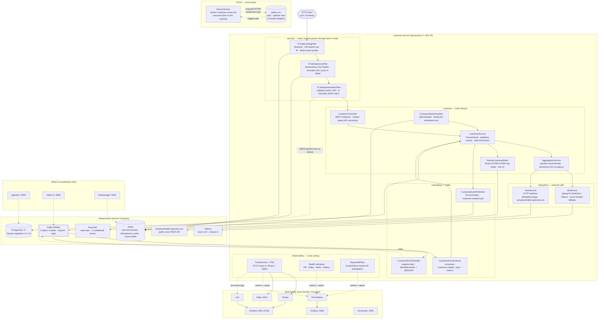

# Spring Boot 4 – Observable Customer Service

This project has one goal: demonstrate what it takes to diagnose an incident on a backend service.
The stack is built around that scenario — not around the technologies themselves.

## Table of contents

- [Architecture — dev (Docker Compose)](#architecture)
- [Architecture — production (Kubernetes)](#architecture--production-kubernetes)
- [Quick start](#quick-start)
- [What this demonstrates](#what-this-demonstrates)
- [Running locally](#running-locally)
- [Local Kubernetes (kind)](#local-kubernetes-kind)
- [CI/CD](#cicd)
- [Screenshots](#screenshots)
- [Detailed documentation](#detailed-documentation)

---

## Architecture



---

## Architecture — production (Kubernetes)

When deployed to a Kubernetes cluster (GKE Autopilot, EKS, AKS, k3s…), the two Docker
images are served behind a single Nginx Ingress on one hostname — eliminating CORS entirely.

```
Internet
    │  HTTPS  (TLS — cert-manager + Let's Encrypt)
    ▼
┌───────────────────────────────────────────────────────────┐
│  Nginx Ingress Controller           namespace: ingress-nginx│
│                                                           │
│  /api/(.*)  →  strip /api  →  customer-service:8080      │
│  /(.*)      →              →  customer-ui:80             │
└────────────────┬──────────────────────┬───────────────────┘
                 │                      │
   namespace: app│                      │
    ─────────────┼──────────────────────┼──────────────────
                 ▼                      ▼
    ┌─────────────────────┐   ┌──────────────────────┐
    │  customer-service   │   │    customer-ui        │
    │  Spring Boot 4      │   │  Angular 21 + Nginx   │
    │  replicas: 2        │   │  replicas: 2          │
    │  HPA: 1–5 @ 70% CPU │   │  RollingUpdate        │
    └────────┬────────────┘   └──────────────────────┘
             │
   namespace: infra
    ─────────┼─────────────────────────────────────────────
             │
    ┌────────┴─────────────────────────────────────┐
    │  PostgreSQL 17          Redis 7               │
    │  StatefulSet + PVC      Deployment            │
    │  10 Gi storage          128 MB maxmemory      │
    │  Flyway migrations      JWT blacklist +       │
    │  (V1–V6)                ring buffer           │
    │                                               │
    │  Kafka 3.8 (KRaft)                            │
    │  Deployment — no ZooKeeper                    │
    │  Topics: created / request / reply            │
    └───────────────────────────────────────────────┘

Six deployment targets in CI (deploy stage):

  ✓ GKE Autopilot    — auto on main push (default)
  ▶ AWS EKS          — manual
  ▶ Azure AKS        — manual
  ▶ Google Cloud Run — manual (serverless, no cluster)
  ▶ Fly.io           — manual (PaaS)
  ▶ k3s / bare metal — manual (any kubectl-reachable cluster)
```

> **Same-origin design**: the browser always calls `https://app.example.com/api/…`.
> Nginx strips `/api` and proxies to the backend. No CORS headers needed.

---

## Quick start

```bash
# Start everything (Docker + observability + app)
./run.sh all

# Or step by step:
docker compose up -d              # infra (DB, Kafka, Redis, Ollama, Keycloak, admin tools)
./run.sh obs                      # observability (Grafana, Prometheus, Tempo, Zipkin, Pyroscope)
./run.sh app                      # Spring Boot app

# Get a token
TOKEN=$(curl -s -X POST http://localhost:8080/auth/login \
  -H 'Content-Type: application/json' \
  -d '{"username":"admin","password":"admin"}' | jq -r .token)

# Create a customer (20 demo customers are pre-loaded by Flyway)
curl -s -X POST http://localhost:8080/customers \
  -H "Authorization: Bearer $TOKEN" \
  -H 'Content-Type: application/json' \
  -d '{"name":"Alice","email":"alice@example.com"}'

# Generate traffic for dashboards
./run.sh simulate

# Check status of all services
./run.sh status
```

---

## What this demonstrates

### Core — observability and diagnosis

| Capability | How it's implemented |
|---|---|
| Distributed tracing | OpenTelemetry → Tempo (via LGTM on port 3001); DB spans via `datasource-micrometer` |
| Metrics and latency histograms | Micrometer → Prometheus → Grafana (p50/p95/p99, custom counters) |
| Structured logs correlated with traces | OTel log exporter → Loki, trace ID injected in every log line |
| Health probes | Custom indicators for DB, Kafka, Redis, Ollama; liveness/readiness groups |
| Operational endpoints | `/actuator/health/readiness`, `/actuator/prometheus`, Swagger UI |

### Additional patterns

| Pattern | What it illustrates |
|---|---|
| Kafka fire-and-forget + request-reply | Async decoupling vs sync correlation with built-in timeout |
| JWT + optional Keycloak + API key | Three auth modes in one filter chain |
| Resilience4j circuit breaker + retry | Graceful degradation when an external dependency fails |
| Bucket4j rate limiting | Token-bucket per IP, enforced before business logic |
| WebSocket notifications | Real-time push on customer creation via STOMP |
| Cursor pagination + search | Efficient pagination + full-text search on name/email |
| Batch import + CSV export | Bulk operations with streaming response |
| Virtual threads (Project Loom) | Parallel sub-tasks in `AggregationService` |

### Security

| Pattern | What it illustrates |
|---|---|
| OWASP security headers | CSP, X-Frame-Options, nosniff, Referrer-Policy |
| Brute-force protection | IP lockout after 5 failed login attempts (15 min) |
| Input sanitization | `@Size(max=255)`, request body limit (1 MB) |
| Audit logging | DB-backed `audit_event` table — who, what, when, IP |
| SQL injection / XSS demos | Vulnerable vs safe endpoints for education |
| OWASP Dependency-Check | CVE scan on all dependencies |

---

## Running locally

```bash
./run.sh all            # start everything (infra + obs + app)
./run.sh restart        # stop + restart everything (keeps data)
./run.sh stop           # stop app + all containers
./run.sh nuke           # full cleanup — containers, volumes, build artifacts
./run.sh status         # check status of all services
./run.sh simulate       # generate traffic (60 iterations, 2s pause)
./run.sh app-profiled   # start app with Pyroscope profiling

./run.sh test           # unit tests (no Docker)
./run.sh integration    # integration tests (Testcontainers)
./run.sh verify         # lint + unit + integration (mirrors CI)
./run.sh security-check # OWASP Dependency-Check (CVE scan)
```

Pre-push hook (via lefthook) runs unit tests automatically before every `git push`.

### Port reference

> **⚠️ Two runtime modes — two different API ports**
>
> | Mode | Frontend | API |
> |------|----------|-----|
> | **Docker Compose** (`./run.sh all`) | http://localhost:4200 (`ng serve`) | http://localhost:**8080** |
> | **kind cluster** (`deploy-local.sh`) | http://localhost:**8090** (nginx-ingress) | http://localhost:**8090**/api |
>
> `ng serve` always targets port **8080** (local Spring Boot process).  
> The kind cluster bundles everything behind **8090** — use the kind URL if the app is only running in Kubernetes.

#### Application

| Service | Port | URL |
|---------|------|-----|
| Spring Boot API (local) | 8080 | http://localhost:8080/swagger-ui.html |
| Angular UI (`ng serve`) | 4200 | http://localhost:4200 → API on :8080 |
| kind ingress — frontend + API | 8090 | http://localhost:8090 (HTTPS: 8443) |

#### Data stores

| Service | Port | Notes |
|---------|------|-------|
| PostgreSQL | 5432 | user: `demo` / pass: `demo` |
| Redis | 6379 | |
| Kafka (KRaft) | 9092 | PLAINTEXT\_HOST listener |
| Ollama (LLM) | 11434 | llama3.2:1b — pulled on first start |
| Keycloak | 9090 | admin / admin · realm: `customer-service` |

#### Admin tools

| Service | Port | URL |
|---------|------|-----|
| pgAdmin | 5050 | http://localhost:5050 (no login) |
| pgweb | 8081 | http://localhost:8081 |
| Kafka UI | 9080 | http://localhost:9080 |
| Redis Commander | 8082 | http://localhost:8082 |
| RedisInsight | 5540 | http://localhost:5540 |

#### Observability

| Service | Port | URL / Notes |
|---------|------|-------------|
| Grafana (standalone) | 3000 | http://localhost:3000 · Prometheus datasource |
| Grafana LGTM | 3001 | http://localhost:3001 · **Tempo + Loki** datasources |
| Tempo Explore | 3001 | http://localhost:3001/explore → select Tempo |
| Tempo HTTP API | 3200 | `GET /api/traces/{traceId}` — direct trace lookup |
| Prometheus | 9091 | http://localhost:9091 (9090 used by Keycloak) |
| Loki (CORS proxy) | 3100 | Nginx proxy adding `Access-Control-Allow-Origin` |
| OTLP HTTP collector | 4318 | Spring Boot sends traces + logs here |
| Pyroscope | 4040 | http://localhost:4040 · CPU/memory flamegraphs |

#### Infrastructure

| Service | Port | Notes |
|---------|------|-------|
| Docker API proxy | 2375 | Filtered read-only Docker Engine API (CORS) |
| GitLab Runner | — | Outbound HTTPS polling — no port exposed |

---

## Screenshots

### Grafana — HTTP metrics


### Prometheus — raw metrics


### Grafana — OpenTelemetry traces


---

## Detailed documentation

| Document | Content |
|----------|---------|
| [Architecture](docs/architecture.md) | Component reference, call flows, code organisation |
| [API Reference](docs/api.md) | All endpoints with curl examples |
| [Security](docs/security.md) | OWASP patterns, demo scenarios, headers |
| [Observability](docs/observability.md) | Dashboards, diagnostic scenarios, Kafka patterns, resilience |

---

## Spring Boot & Java compatibility

The default build targets **Spring Boot 4.0.5 + Java 25**. Maven profiles enable compilation
and testing against older versions — no code change required.

### Supported combinations

| Command | Spring Boot | Java | Notes |
|---------|-------------|------|-------|
| `mvn verify` | 4.0.5 | 25 | Default — native API versioning, `ScopedValue`, switch pattern matching |
| `mvn verify -Dcompat` | 4.0.5 | 21 | `ScopedValue` replaced by `ThreadLocal` |
| `mvn verify -Dcompat -Djava17` | 4.0.5 | 17 | + switch pattern matching replaced by if/else |
| `mvn verify -Dsb3` | 3.4.5 | 21 | SB3 BOM + `ThreadLocal` + manual header-based API versioning |
| `mvn verify -Dsb3 -Djava17` | 3.4.5 | 17 | SB3 + Java 17 (all compat layers applied) |

### How it works

Source overlays in dedicated directories replace version-specific files at compile time.
The compiler is pointed at a merged copy — no original file is modified.

| Overlay directory | Replaces | Why |
|-------------------|----------|-----|
| `src/main/java-compat/` | `RequestContext`, `RequestIdFilter`, `TraceService` | `ScopedValue` (Java 25) → `ThreadLocal` (Java 17/21) |
| `src/main/java-compat-java17/` | `ApiExceptionHandler` | switch pattern matching (Java 21) → if/else (Java 17) |
| `src/main/java-sb3/` | `CustomerController` | `@GetMapping(version=...)` (Spring 7) → manual `X-API-Version` header dispatch |
| `src/test/java-sb3/` | `AutoConfigureMockMvc` | Bridge annotation: SB4 package → SB3 package |

The `RestTestClient`-based test (`CustomerRestClientITest`) is excluded from SB3 builds
since that class only exists in Spring Framework 7. The `CustomerApiITest` (MockMvc) covers
the same endpoints.

### Maven compatibility

The project supports both **Maven 3.9.x** (default) and **Maven 4.0.x**.

The Maven Wrapper (`./mvnw`) pins the exact version. To switch:

```bash
# Edit .mvn/wrapper/maven-wrapper.properties and uncomment the desired distributionUrl:
#   Maven 3.9.14 (default)
#   Maven 4.0.0-rc-3

# Then verify:
./mvnw --version
```

**Tested with Maven 4.0.0-rc-3** — all 5 profile combinations compile and pass tests.
All plugin versions are resolved via the `spring-boot-starter-parent` `<pluginManagement>`,
which Maven 4 accepts. No unversioned plugins, no deprecated `<prerequisites>` or
`<reporting>` sections. The `maven-antrun-plugin` conditional copies (`xmlns:if="ant:if"`)
use standard Ant features supported by both Maven versions.

---

## Local Kubernetes (kind)

Spin up a full production-equivalent stack on your machine using
[kind](https://kind.sigs.k8s.io/) (Kubernetes IN Docker). One command deploys
Postgres, Redis, Kafka, the Spring Boot backend, and the Angular frontend.

```bash
# Prerequisites (once)
brew install kind kubectl

# Deploy everything (builds images, creates cluster, applies manifests)
./scripts/deploy-local.sh

# Re-deploy after a code change (skip the image rebuild)
./scripts/deploy-local.sh --skip-build

# Tear down
./scripts/deploy-local.sh --delete
```

| Endpoint | URL |
|----------|-----|
| Frontend | http://localhost:8090 |
| API | http://localhost:8090/api |
| Swagger | http://localhost:8090/api/swagger-ui.html |
| Health | http://localhost:8090/api/actuator/health |

Credentials: `admin/admin` · `user/user` · `viewer/viewer`

> **Note on macOS**: kind defaults to `kindest/node:v1.35.0` which has a kubelet
> startup timeout on Docker Desktop. The config pins `v1.31.4` which is stable.

---

## CI/CD

### GitLab pipeline stages

| Stage | Jobs | Trigger |
|-------|------|---------|
| `lint` | Hadolint (Dockerfile) | Every push |
| `test` | Unit tests, OWASP scan | Every push |
| `integration` | Failsafe ITests (Testcontainers), SpotBugs, JaCoCo | Every push |
| `package` | JAR + Docker image (`--cache-from` for fast rebuilds) | `main` + tags |
| `compat` | 4 SB/Java combos | Manual / `RUN_COMPAT=true` |
| `native` | GraalVM native image | Daily schedule |
| `deploy` | 6 deployment targets (see above) | `main` |

### Run CI jobs locally (free, no gitlab.com minutes)

```bash
# 1. Start the runner
docker compose -f docker-compose.runner.yml up -d

# 2. Register it (one-time — get the token from gitlab.com → Settings → CI/CD → Runners)
./scripts/register-runner.sh glrt-xxxxxxxxxxxx
```

After registration every push triggers jobs on **your machine** instead of gitlab.com shared runners.

| Pipeline | Config |
|----------|--------|
| GitLab CI | `.gitlab-ci.yml` |
| GitHub Actions | `.github/workflows/ci.yml` |

```bash
./run.sh verify   # local equivalent of the full CI pipeline (no Docker needed)
```
