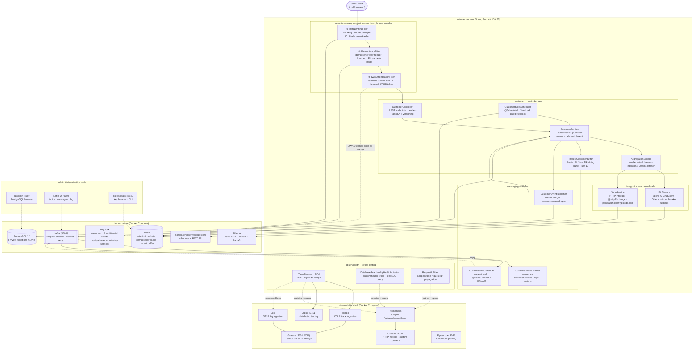
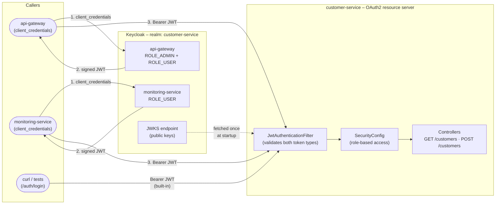
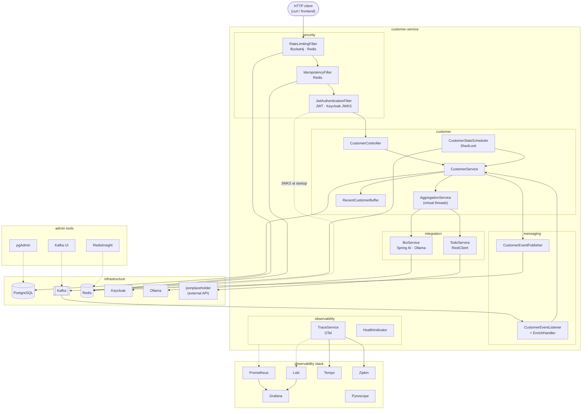

# Spring Boot 4 – Observable Customer Service

This project has one goal: demonstrate what it takes to diagnose an incident on a backend service.
The stack is built around that scenario — not around the technologies themselves.

---

## Architecture

### System diagram



### Component reference

#### Security pipeline — applied to every HTTP request, in this order

| # | Component | Role | Interfaces with |
|---|-----------|------|-----------------|
| ① | `RateLimitingFilter` | Token-bucket rate limiter: 100 req/min per source IP. Rejects with HTTP 429 before any business logic runs. Uses Bucket4j with a Redis-backed store so the limit is shared across multiple application instances. | Redis (token bucket state) |
| ② | `IdempotencyFilter` | If the request carries an `Idempotency-Key` header, checks a bounded in-memory + Redis cache. On a cache hit, returns the cached response immediately — the controller never executes. On a miss, executes the request and stores the response. Prevents duplicate `POST /customers` from two parallel network retries. | Redis (idempotency cache) |
| ③ | `JwtAuthenticationFilter` | Validates the `Authorization: Bearer <token>` header. Supports **two token issuers in parallel**: (a) built-in tokens signed by `JwtTokenProvider` (HMAC-SHA256, obtained from `POST /auth/login`); (b) Keycloak tokens validated via JWKS (RSA, fetched once at startup from Keycloak's well-known endpoint). A single filter avoids the `SecurityContext` wipe that occurs when Spring Security's `BearerTokenAuthenticationFilter` runs alongside a custom filter. | Keycloak (JWKS, startup only) |

#### Customer domain

| Component | Role | Interfaces with |
|-----------|------|-----------------|
| `CustomerController` | REST layer. Maps HTTP verbs to service calls. Implements header-based API versioning (`X-API-Version: 2.0` → `CustomerDtoV2` with `createdAt`). Delegates all business logic to `CustomerService`. | `CustomerService`, Spring MVC |
| `CustomerService` | Transactional service. Orchestrates persistence (`CustomerRepository`), event publishing, Redis ring buffer update, and enrichment replies. All writes are wrapped in a transaction; Kafka publish happens after commit to avoid phantom events on rollback. | `CustomerRepository` (PostgreSQL), `CustomerEventPublisher` (Kafka), `RecentCustomerBuffer` (Redis) |
| `AggregationService` | Calls two independent sources concurrently using **Java 25 virtual threads** (`Thread.ofVirtual().start(...)`). Intentionally sleeps 200 ms in each sub-task to simulate I/O latency — verifiable in Tempo as two parallel spans finishing at the same wall-clock time. | `BioService` (Ollama), `TodoService` (HTTP) |
| `RecentCustomerBuffer` | Maintains a fixed-size ring buffer of the 10 most recently created customers. Implemented with Redis `LPUSH + LTRIM + LRANGE` so it survives application restarts and is consistent across instances. Exposed via `GET /customers/recent`. | Redis |
| `CustomerStatsScheduler` | Periodic background task (`@Scheduled`). Protected by **ShedLock** via JDBC — only one instance in a cluster acquires the lock and runs the task. Prevents duplicated stats computation when multiple replicas are running. | PostgreSQL (ShedLock table), Redis (stats cache) |

#### Messaging (Kafka)

| Component | Role | Topic | Interfaces with |
|-----------|------|-------|-----------------|
| `CustomerEventPublisher` | Fire-and-forget publish. After a successful `POST /customers`, sends a `CustomerCreatedEvent` to `customer.created`. Uses `KafkaTemplate<String, Object>` with Jackson JSON serialization and `__TypeId__` header for dynamic type resolution on the consumer side. | `customer.created` (produce) | Kafka |
| `CustomerEventListener` | `@KafkaListener` on `customer.created`. Logs the event, increments a Micrometer counter (`kafka.customer.created.processed`). Demonstrates decoupled async consumption in the same process — in a real system this would be a separate microservice. | `customer.created` (consume) | Kafka, Micrometer |
| `CustomerEnrichHandler` | Synchronous request-reply. `GET /customers/{id}/enrich` sends a `CustomerEnrichRequest` on `customer.request` via `ReplyingKafkaTemplate` (blocks up to 5 s). This handler listens on `customer.request`, builds a `displayName`, and uses `@SendTo` to publish the reply on `customer.reply`. The template correlates the reply back to the waiting caller via a UUID correlation header. Timeout → HTTP 504 with RFC 9457 Problem Details. | `customer.request` (consume), `customer.reply` (produce) | Kafka |

#### Integration (external calls)

| Component | Role | Interfaces with |
|-----------|------|-----------------|
| `BioService` | Calls a local **Ollama** LLM via **Spring AI `ChatClient`**. Wrapped in a **Resilience4j circuit breaker**: after 5 consecutive failures the breaker opens and `BioService` returns a static fallback string immediately, without waiting for Ollama's 30 s timeout. Also wrapped in a Retry (3 attempts with exponential backoff). | Ollama (HTTP, local) |
| `TodoService` | Calls the public `jsonplaceholder.typicode.com` REST API using Spring's **HTTP Interface** (`@HttpExchange`). The interface is bound to a `RestClient` at startup — no Feign or WebClient needed. Also wrapped in Resilience4j circuit breaker + retry. | jsonplaceholder (HTTP, external) |

#### Observability (cross-cutting)

| Component | Role | Interfaces with |
|-----------|------|-----------------|
| `RequestIdFilter` | Generates a UUID request ID and stores it in a **Java 25 `ScopedValue`** (structured concurrency). The ID propagates automatically to child virtual threads without `ThreadLocal` leaks. Included in every log line via MDC. | MDC, ScopedValue |
| `TraceService` + OTel | OpenTelemetry auto-instrumentation decorates every HTTP request, JDBC query, and Kafka send/receive with spans. Exported via OTLP to **Tempo** (traces) and **Loki** (structured logs). Every log line carries `traceId` and `spanId` for cross-signal correlation. | Tempo (OTLP gRPC), Loki (OTLP HTTP) |
| `DatabaseReachabilityHealthIndicator` | Custom `HealthIndicator` that issues a `SELECT 1` query (not just a connection ping) against PostgreSQL. Surfaced at `/actuator/health/readiness`. A Kubernetes readiness probe on this endpoint stops traffic routing before users see errors. | PostgreSQL, `/actuator/health` |
| Micrometer + Prometheus | `ObservabilityConfig` registers custom counters and timers. Spring Boot auto-instruments HTTP server requests (histograms for p50/p95/p99), JVM, datasource, and Kafka. Scraped by Prometheus at `/actuator/prometheus` every 15 s. | Prometheus → Grafana `:3000` |

### Call flows

#### Flow 1 — `POST /customers` (happy path)

```
① RateLimitingFilter       — check bucket in Redis, decrement
② IdempotencyFilter        — check Idempotency-Key in Redis (miss → proceed)
③ JwtAuthenticationFilter  — validate JWT, populate SecurityContext (ROLE_ADMIN required)
④ CustomerController       — parse CreateCustomerRequest, call CustomerService
⑤ CustomerService          — BEGIN TRANSACTION
   ⑤a CustomerRepository   — INSERT INTO customers → id=1
   ⑤b RecentCustomerBuffer — LPUSH customer:recent id=1 + LTRIM 0 9
   ⑤c COMMIT
   ⑤d CustomerEventPublisher — KafkaTemplate.send("customer.created", CustomerCreatedEvent{id=1})
⑥ → HTTP 201 {"id":1, "name":"Alice", "email":"alice@example.com"}
   (async, after 201)
⑦ CustomerEventListener    — @KafkaListener on customer.created → logs + counter++
```

#### Flow 2 — `GET /customers/{id}/enrich` (Kafka request-reply)

```
① – ③  same filter pipeline
④ CustomerController        — call CustomerService.enrich(id)
⑤ CustomerService           — call ReplyingKafkaTemplate.sendAndReceive("customer.request",
                               CustomerEnrichRequest{id}, timeout=5s)
   ⑤a Kafka broker          — routes message to customer.request
   ⑤b CustomerEnrichHandler — @KafkaListener, builds displayName="Alice <alice@example.com>"
   ⑤c @SendTo               — KafkaTemplate.send("customer.reply", CustomerEnrichReply{displayName})
   ⑤d ReplyingKafkaTemplate — correlates reply via UUID header, unblocks
⑥ → HTTP 200 {"id":1, "displayName":"Alice <alice@example.com>"}
   timeout → HTTP 504  {"type":"urn:problem:kafka-timeout", "status":504}
```

#### Flow 3 — `GET /customers/aggregate` (parallel virtual threads)

```
① – ③  same filter pipeline
④ CustomerController  — call AggregationService.aggregate()
⑤ AggregationService  — spawn two virtual threads concurrently:
   ⑤a Thread 1        — BioService → Spring AI ChatClient → POST http://ollama:11434/api/chat
                         (Resilience4j circuit breaker + retry wraps this call)
   ⑤b Thread 2        — TodoService → RestClient → GET https://jsonplaceholder.typicode.com/todos/1
                         (Resilience4j circuit breaker + retry wraps this call)
   both sleep 200 ms to simulate I/O — threads released, not blocked
   both join ~200 ms later (not 400 ms)
⑥ → HTTP 200 {aggregated result}
   p50 ≈ 200 ms, p99 ≈ 220 ms  (visible in Grafana :3000)
   two overlapping child spans visible in Tempo trace
```

#### Flow 4 — Keycloak machine-to-machine auth

```
api-gateway service                 Keycloak                    customer-service
      │                                │                               │
      │── POST /realms/customer-service/protocol/openid-connect/token ─►
      │   grant_type=client_credentials                                │
      │   client_id=api-gateway                                        │
      │   client_secret=dev-secret                                     │
      │◄── signed JWT (RSA, 1h TTL, roles: ROLE_ADMIN + ROLE_USER) ───│
      │                                                                 │
      │── GET /customers  Bearer <jwt> ────────────────────────────────►
      │                                         JwtAuthenticationFilter│
      │                                      fetches JWKS (cached)     │
      │                                      verifies RSA signature     │
      │                                      extracts realm_access.roles│
      │◄── 200 OK ──────────────────────────────────────────────────────│
```

---

## Quick start

```bash
# 1. Start infrastructure (PostgreSQL, Kafka, Redis, Ollama, Keycloak)
docker compose up -d

# 1b. (optional) Start observability stack (Grafana, Prometheus, Loki, Tempo, Zipkin, Pyroscope)
./run.sh obs

# 2. Start the application locally
./run.sh app

# 3. Get a token
TOKEN=$(curl -s -X POST http://localhost:8080/auth/login \
  -H 'Content-Type: application/json' \
  -d '{"username":"admin","password":"admin"}' | jq -r .token)

# 3. Create a customer
curl -s -X POST http://localhost:8080/customers \
  -H "Authorization: Bearer $TOKEN" \
  -H 'Content-Type: application/json' \
  -d '{"name":"Alice","email":"alice@example.com"}'
# → {"id":1,"name":"Alice","email":"alice@example.com"}
# (20 demo customers are pre-loaded by Flyway at startup)

# 5. Trigger synchronous Kafka enrichment
curl -s http://localhost:8080/customers/1/enrich \
  -H "Authorization: Bearer $TOKEN"
# → {"id":1,"name":"Alice","email":"alice@example.com","displayName":"Alice <alice@example.com>"}

# 6. Observe
curl -s http://localhost:8080/actuator/prometheus | grep customer
open http://localhost:3000   # Grafana — HTTP throughput, latency, customer count
open http://localhost:3001   # Grafana + OTel — distributed traces (Tempo), structured logs (Loki)
open http://localhost:9411   # Zipkin — distributed traces
open http://localhost:5050   # pgAdmin — PostgreSQL browser
open http://localhost:9080   # Kafka UI — topics, messages, consumer groups
open http://localhost:5540   # RedisInsight — Redis key browser

# 7. Generate traffic for observability dashboards
./run.sh simulate           # 60 iterations of mixed API traffic
```

---

## What this demonstrates

### Core — observability and diagnosis

Everything in this section is necessary to answer: *what is slow, what failed, and why?*

| Capability | How it's implemented |
|---|---|
| Distributed tracing | OpenTelemetry → Tempo (OTLP) + Zipkin (dual export); DB spans via `datasource-micrometer` |
| Metrics and latency histograms | Micrometer → Prometheus → Grafana (p50/p95/p99, custom counters) |
| Structured logs correlated with traces | OTel log exporter → Loki, trace ID injected in every log line |
| Health probes | Custom `DatabaseReachabilityHealthIndicator`, liveness/readiness groups |
| Operational endpoints | `/actuator/health/readiness`, `/actuator/prometheus`, Swagger UI |

### Secondary — additional patterns covered

These patterns are present and documented, but they support the scenario rather than define it.

| Pattern | What it illustrates |
|---|---|
| Kafka fire-and-forget + request-reply | Async decoupling vs sync correlation with built-in timeout |
| JWT + optional Keycloak | Two auth modes in one filter chain without interference |
| Resilience4j circuit breaker + retry | Graceful degradation when an external dependency fails |
| Bucket4j rate limiting | Token-bucket per IP, enforced before business logic |
| ShedLock | Distributed `@Scheduled` lock — prevents duplicate execution across instances |
| Spring AI + Ollama | Local LLM integration with circuit breaker fallback |
| GraalVM native image | AOT trade-offs: ~50 ms start, ~50 MB RSS vs JVM baseline |
| Virtual threads (Project Loom) | Parallel sub-tasks in `AggregationService`, enabled globally |

### Security — application security patterns

| Pattern | What it illustrates |
|---|---|
| OWASP security headers | `SecurityHeadersFilter` — CSP, X-Frame-Options, nosniff, Referrer-Policy |
| Input sanitization | `@Size(max=255)` on DTOs, request body limit (1 MB) |
| Brute-force protection | `LoginAttemptService` — IP lockout after 5 failed login attempts (15 min) |
| JWT refresh | `POST /auth/refresh` — extend session without re-login |
| Audit logging | `AuditService` + `audit_event` table — who did what, when, from which IP |
| API key (M2M) | `X-API-Key` header for machine-to-machine calls without JWT |
| API versioning deprecation | `Deprecation` + `Sunset` headers on v1 endpoints |
| SQL injection demo | `/demo/security/sqli-vulnerable` vs `/demo/security/sqli-safe` |
| XSS demo | `/demo/security/xss-vulnerable` vs `/demo/security/xss-safe` |
| CORS info | `/demo/security/cors-info` — explains misconfiguration risks |
| OWASP Dependency-Check | Maven plugin scans dependencies for known CVEs |
| Docker management | `GET /docker/containers`, `POST /docker/containers/{name}/stop\|start\|restart` |

---

## Security demo scenarios

### Scenario A — SQL injection (OWASP A03)

```bash
# Vulnerable: string concatenation → dumps all customers
curl "http://localhost:8080/demo/security/sqli-vulnerable?name=Alice'%20OR%20'1'='1"

# Safe: parameterized query → returns only exact matches
curl "http://localhost:8080/demo/security/sqli-safe?name=Alice"
```

### Scenario B — Brute-force attack

```bash
# After 5 failed attempts, the IP is locked out for 15 minutes
for i in $(seq 1 6); do
  curl -s -X POST http://localhost:8080/auth/login \
    -H 'Content-Type: application/json' \
    -d '{"username":"admin","password":"wrong"}' | jq .
done
# → 6th attempt returns HTTP 429 with retryAfterMinutes: 15
```

### Scenario C — XSS attack

```bash
# Vulnerable: script tag is reflected as HTML
curl "http://localhost:8080/demo/security/xss-vulnerable?name=<script>alert('XSS')</script>"

# Safe: HTML-encoded output
curl "http://localhost:8080/demo/security/xss-safe?name=<script>alert('XSS')</script>"
```

### Scenario D — Dependency vulnerability scan

```bash
./run.sh security-check
# → Report at target/dependency-check-report.html
```

---

## Diagnostic scenarios

Three scenarios that show the observability stack in action.

### Scenario 1 — PostgreSQL unavailability

```bash
docker compose stop db
curl -s http://localhost:8080/actuator/health/readiness | jq .
```

Expected response:
```json
{
  "status": "OUT_OF_SERVICE",
  "components": {
    "db": {"status": "DOWN"},
    "dbReachability": {"status": "DOWN", "details": {"error": "Connection refused"}}
  }
}
```

The `db` check is standard Spring Boot. `dbReachability` is a custom `HealthIndicator`
(`observability/DatabaseReachabilityHealthIndicator`) that issues an actual test query — not just
a connection ping. A Kubernetes readiness probe on this endpoint stops traffic routing before
users see errors.

### Scenario 2 — Endpoint latency on `/customers/aggregate`

```bash
for i in {1..100}; do
  curl -s http://localhost:8080/customers/aggregate \
    -H "Authorization: Bearer $TOKEN" > /dev/null
done
```

Expected in Grafana (http://localhost:3000):
- p50 ≈ **200 ms** — two parallel virtual-thread tasks (not 400 ms sequential)
- p99 ≈ **220–250 ms** — low tail latency, no thread pool contention

In Tempo traces: the `loadCustomerData` and `loadStats` sub-spans start and end at the same time,
confirming that virtual-thread parallelism works and the latency is bounded.

```bash
# Raw metric
curl -s http://localhost:8080/actuator/prometheus \
  | grep 'http_server_requests_seconds.*aggregate'
# http_server_requests_seconds_sum{uri="/customers/aggregate",...} ~20.0
```

### Scenario 3 — Kafka enrichment timeout

```bash
docker compose stop kafka
curl -s http://localhost:8080/customers/1/enrich \
  -H "Authorization: Bearer $TOKEN"
```

Expected after 5 s:
```json
{"type":"urn:problem:kafka-timeout","title":"Kafka Reply Timeout","status":504}
```

The `ReplyingKafkaTemplate` blocks for 5 s then throws — caught by the global exception handler
and mapped to RFC 9457 Problem Details. The timeout metric:
```bash
curl -s http://localhost:8080/actuator/metrics/customer.enrich.duration
```

---

## API reference

### Authentication

All endpoints except `/auth/login` and `/actuator/**` require a Bearer token.

Two auth modes coexist in the same filter chain:



```bash
curl -s -X POST http://localhost:8080/auth/login \
  -H 'Content-Type: application/json' \
  -d '{"username":"admin","password":"admin"}'
# → {"token":"eyJhbGci..."}

export TOKEN=<token>
```

### Customer endpoints

```bash
# List all customers
curl -s http://localhost:8080/customers -H "Authorization: Bearer $TOKEN"

# List — API v2 (adds createdAt field)
curl -s http://localhost:8080/customers \
  -H "Authorization: Bearer $TOKEN" -H "X-API-Version: 2.0"

# Create (ROLE_ADMIN required)
curl -s -X POST http://localhost:8080/customers \
  -H "Authorization: Bearer $TOKEN" -H 'Content-Type: application/json' \
  -d '{"name":"Alice","email":"alice@example.com"}'

# Idempotent create (same Idempotency-Key returns cached response, no duplicate insert)
curl -s -X POST http://localhost:8080/customers \
  -H "Authorization: Bearer $TOKEN" -H 'Content-Type: application/json' \
  -H 'Idempotency-Key: req-001' \
  -d '{"name":"Alice","email":"alice@example.com"}'

# 10 most recent customers (Redis ring buffer)
curl -s http://localhost:8080/customers/recent -H "Authorization: Bearer $TOKEN"

# Aggregate (200 ms intentional latency — parallel virtual threads)
curl -s http://localhost:8080/customers/aggregate -H "Authorization: Bearer $TOKEN"

# Enrich via Kafka request-reply (blocks up to 5 s)
curl -s http://localhost:8080/customers/1/enrich -H "Authorization: Bearer $TOKEN"
```

### Operational endpoints (no auth)

```bash
curl -s http://localhost:8080/actuator/health
curl -s http://localhost:8080/actuator/health/readiness
curl -s http://localhost:8080/actuator/prometheus | grep 'http_server_requests\|customer'
```

---

## Observability

| Dashboard | URL | Shows |
|-----------|-----|-------|
| Grafana — HTTP | http://localhost:3000 | Throughput, latency (p50/p95/p99), customer creation rate, buffer size |
| Prometheus | http://localhost:9090 | Raw metrics, histogram queries |
| Grafana — OTel | http://localhost:3001 | Distributed traces (Tempo), structured logs (Loki) |
| Zipkin | http://localhost:9411 | Distributed traces — lightweight alternative to Tempo |
| Pyroscope | http://localhost:4040 | Continuous profiling — CPU/memory flamegraphs |
| pgAdmin | http://localhost:5050 | PostgreSQL web admin (admin@demo.com / admin) |
| Kafka UI | http://localhost:9080 | Topics, messages, consumer groups, lag |
| RedisInsight | http://localhost:5540 | Redis key browser, CLI, memory analysis |
| Keycloak | http://localhost:9090 | OAuth2 identity provider admin console (admin / admin) |

### Trace a request end-to-end

1. `POST /customers` with `Authorization: Bearer $TOKEN`
2. Open http://localhost:3001 → Explore → Tempo
3. Search by service `customer-service`, operation `POST /customers`
4. The trace shows: HTTP handler span → DB insert span → Kafka publish span

---

## Kafka patterns

### Pattern 1 — Asynchronous (fire-and-forget)

`POST /customers` persists the customer then publishes a `CustomerCreatedEvent` on `customer.created`
without waiting for acknowledgement. A `@KafkaListener` in the same app consumes the event and logs it.

```
POST /customers → CustomerService → KafkaTemplate.send("customer.created") → 201 Created
                                              ↓ (async, decoupled)
                                    CustomerEventListener → logs: kafka_event type=CustomerCreatedEvent
```

```bash
curl -s http://localhost:8080/actuator/metrics/kafka.customer.created.processed
```

### Pattern 2 — Synchronous (request-reply)

`GET /customers/{id}/enrich` sends a request to `customer.request` and blocks until the reply
arrives on `customer.reply` (timeout: 5 s). `ReplyingKafkaTemplate` handles correlation automatically.

```
GET /customers/{id}/enrich
  → ReplyingKafkaTemplate.sendAndReceive("customer.request")  [blocks, max 5 s]
      ↓
  CustomerEnrichHandler [@KafkaListener + @SendTo] → reply on "customer.reply"
      ↓
  → {"displayName":"Alice <alice@example.com>"}
```

---

## Resilience

### Circuit breaker on external calls

`BioService` calls Ollama (local LLM). If Ollama is down, the circuit breaker opens after 5 failures
and returns a degraded response immediately — no 30 s timeout chain.

```bash
# Stop Ollama, then call enrich several times — circuit transitions CLOSED → OPEN
docker compose stop ollama
curl -s http://localhost:8080/actuator/metrics/resilience4j.circuitbreaker.state \
  --data-urlencode "tag=name:ollama"
```

### Rate limiting

```bash
# 101st request in the same minute → 429
curl -s http://localhost:8080/customers -H "Authorization: Bearer $TOKEN"
```

---

## Running locally

```bash
./run.sh help           # all commands

./run.sh db             # PostgreSQL only
./run.sh kafka          # Kafka (KRaft, no ZooKeeper)
./run.sh obs            # full observability stack (Grafana, Prometheus, Loki, Tempo, Zipkin, Pyroscope)
./run.sh app            # Spring Boot app (local Maven)
./run.sh app-profiled   # Spring Boot app with Pyroscope Java agent (CPU/memory flamegraphs)
./run.sh all            # everything + the application
./run.sh simulate       # generate traffic (60 iterations, configurable)

./run.sh test           # unit tests (no Docker)
./run.sh integration    # integration tests (Testcontainers — requires Docker)
./run.sh verify         # lint + unit + integration (mirrors CI)
```

Pre-push hook (via lefthook) runs unit tests automatically before every `git push`.

---

## Code organisation

```
com.example.customerservice
├── api/            ApiError, ApiExceptionHandler          — RFC 9457 error responses
├── auth/           JwtTokenProvider, JwtAuthenticationFilter,
│                   SecurityConfig, AuthController         — JWT auth + Spring Security
├── customer/       Customer, CustomerRepository,
│                   CustomerService, CustomerController,
│                   CustomerDto, CustomerDtoV2,            — core domain
│                   AggregationService, RecentCustomerBuffer,
│                   CustomerStatsScheduler
├── integration/    BioService, JsonPlaceholderClient,
│                   TodoService                            — external HTTP calls (HTTP Interface + Spring AI)
├── messaging/      KafkaConfig, CustomerCreatedEvent,
│                   CustomerEnrichHandler,
│                   CustomerEventListener                  — Kafka fire-and-forget + request-reply
├── observability/  ObservabilityConfig, DatabaseReachabilityHealthIndicator,
│                   RequestIdFilter, RequestContext,
│                   TraceService, ZipkinExporterConfig      — health, tracing, metrics, request ID
├── resilience/     IdempotencyFilter, RateLimitingFilter,
│                   ShedLockConfig                         — rate limiting, idempotency, distributed lock
└── CustomerServiceApplication.java
```



---

## CI/CD

The project runs the same pipeline on two platforms simultaneously.

**Why both?**
GitLab CI is the primary pipeline — it has SAST, dependency scanning, and the scheduled GraalVM
native build. GitHub Actions provides public visibility: anyone browsing the GitHub mirror sees
green checks, test results, and a published Docker image without needing access to the GitLab
instance. The two pipelines are kept intentionally in sync; divergence would defeat the purpose.

| Pipeline | Config | Trigger | Jobs |
|----------|--------|---------|------|
| **GitLab CI** | `.gitlab-ci.yml` | MR push + main push | hadolint → unit tests + SAST + dependency scan → integration tests + SpotBugs + JaCoCo → JAR + Docker image |
| **GitHub Actions** | `.github/workflows/ci.yml` | Push + PR | Same stages — mirrors the GitLab pipeline |

Scheduled (daily, both platforms): GraalVM native image — only when `Dockerfile.native`, `pom.xml` or `src/` changed (5–15 min, skipped otherwise).

```bash
./run.sh verify   # local equivalent of the full CI pipeline
```

---

## Screenshots

### Grafana — HTTP metrics


### Prometheus — raw metrics


### Grafana — OpenTelemetry traces


---

## Appendix: Full mechanism list

| Area | Mechanism | Where |
|---|---|---|
| **Language** | Java 21+ virtual threads (`spring.threads.virtual.enabled`) | `application.yml` |
| **Language** | Java 21+ `ScopedValue` for request-ID propagation | `observability/RequestContext`, `RequestIdFilter` |
| **Language** | Java 16+ Records for DTOs | `CustomerDto`, `CreateCustomerRequest`, `EnrichedCustomerDto` |
| **API** | Spring Boot 4 `spring.mvc.apiversion.*` — header-based versioning | `application.yml`, `CustomerController`, `CustomerDtoV2` |
| **API** | RFC 9457 Problem Details | `api/ApiExceptionHandler`, `spring.mvc.problemdetails.enabled` |
| **Security** | JWT Bearer token authentication (JJWT) | `auth/` package |
| **Security** | Spring Security role-based access (`ROLE_ADMIN` / `ROLE_USER`) | `auth/SecurityConfig` |
| **Security** | Keycloak OAuth2 resource server integration | `auth/SecurityConfig`, `docker-compose.yml` |
| **Resilience** | Bucket4j token-bucket rate limiting (per IP, 100 req/min) | `resilience/RateLimitingFilter` |
| **Resilience** | Idempotency header (`Idempotency-Key`) with bounded LRU cache | `resilience/IdempotencyFilter` |
| **Resilience** | Resilience4j circuit breaker + retry on external HTTP calls | `integration/TodoService`, `BioService` |
| **Resilience** | ShedLock distributed scheduler lock (JDBC provider) | `resilience/ShedLockConfig`, `customer/CustomerStatsScheduler` |
| **Messaging** | Kafka fire-and-forget async event publish | `messaging/CustomerEventListener` |
| **Messaging** | Kafka synchronous request-reply (`ReplyingKafkaTemplate`) | `messaging/CustomerEnrichHandler` |
| **Integration** | HTTP Interface (`@HttpExchange`) for external REST calls | `integration/JsonPlaceholderClient` |
| **Integration** | Spring AI ChatClient with Ollama (local LLM) + circuit breaker | `integration/BioService` |
| **Observability** | Micrometer + Prometheus metrics scraping | `observability/ObservabilityConfig` |
| **Observability** | OpenTelemetry trace export to Tempo | `application.yml` (OTLP config) |
| **Observability** | Zipkin trace export (dual export alongside OTLP) | `observability/ZipkinExporterConfig` |
| **Observability** | Pyroscope continuous profiling (CPU/memory flamegraphs) | `infra/pyroscope/pyroscope.jar`, `run.sh app-profiled` |
| **Observability** | OpenTelemetry structured log export to Loki | `application.yml` (OTLP config) |
| **Observability** | JDBC DataSource instrumentation (datasource-micrometer) | `pom.xml` |
| **Observability** | Custom health indicator + liveness/readiness probes | `observability/DatabaseReachabilityHealthIndicator` |
| **Data** | Flyway schema migrations | `db/migration/V1__*.sql`, `V2__*.sql` |
| **Data** | Repeatable seed migration (20 demo customers) | `db/migration/R__seed_demo_customers.sql` |
| **Data** | Traffic simulation script | `infra/simulate-traffic.sh`, `run.sh simulate` |
| **Testing** | Testcontainers (PostgreSQL + Kafka) integration tests | `AbstractIntegrationTest` |
| **Testing** | Spring Boot 4 `RestTestClient` MockMvc DSL | `customer/CustomerRestClientITest` |
| **Testing** | ArchUnit architectural constraint tests | `ArchitectureTest` |
| **Testing** | JaCoCo merged unit + integration coverage gate (≥ 60 %) | `pom.xml` |
| **Build** | SpotBugs static bytecode analysis (Medium threshold) | `pom.xml`, `spotbugs-exclude.xml` |
| **Build** | GraalVM native image support (`-Pnative`) | `pom.xml` native profile, `Dockerfile.native` |
| **Build** | Docker layered JAR optimisation | `Dockerfile` |
| **Security** | OWASP security headers (CSP, X-Frame-Options, nosniff) | `auth/SecurityHeadersFilter` |
| **Security** | Input sanitization (`@Size(max=255)`) + request body limit (1 MB) | `customer/CreateCustomerRequest`, `application.yml` |
| **Security** | Brute-force login protection (5 attempts, 15 min lockout) | `auth/LoginAttemptService` |
| **Security** | JWT token refresh (`POST /auth/refresh`) | `auth/AuthController` |
| **Security** | Audit logging (DB-backed `audit_event` table) | `observability/AuditService`, `V4__create_audit_event.sql` |
| **Security** | SQL injection demo (vulnerable vs parameterized) | `customer/SecurityDemoController` |
| **Security** | XSS demo (reflected vs HTML-encoded) | `customer/SecurityDemoController` |
| **Security** | CORS misconfiguration explanation | `customer/SecurityDemoController` |
| **Security** | API versioning deprecation headers (Deprecation + Sunset) | `customer/CustomerController` |
| **Security** | OWASP Dependency-Check (CVE scan) | `pom.xml`, `run.sh security-check` |
| **Security** | Docker container management API | `customer/DockerController` |
