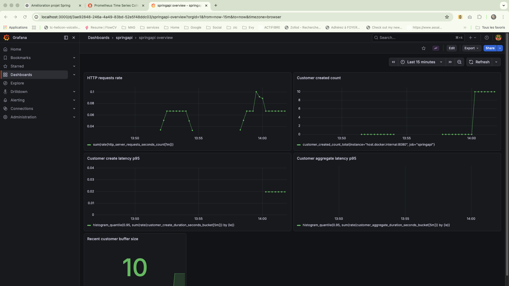
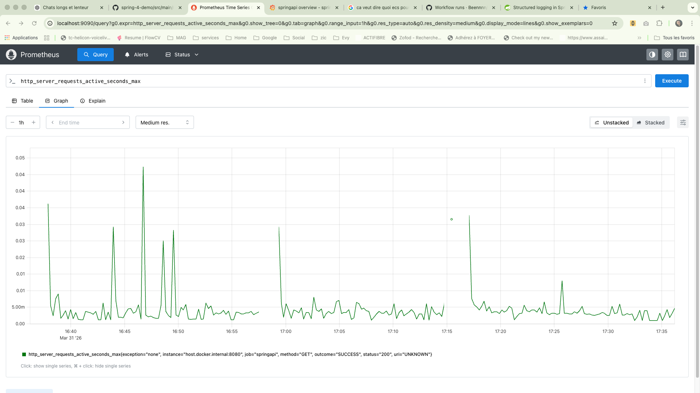

# Spring Boot 4 – Service observable

Mini service Spring Boot 4 / Java 25 utilisé comme démonstrateur de :

- structuration d’un socle applicatif
- observabilité (métriques, logs, tracing)
- qualité d’exploitation
- diagnostic rapide en cas d’incident

---

## 🎯 Objectif

Ce projet ne vise pas à démontrer un simple CRUD, mais la capacité à :

- rendre un service observable
- définir ce qu’il faut surveiller
- exposer des points de diagnostic
- structurer un environnement d’exploitation minimal

---

## 🧱 Stack

- Java 25
- Spring Boot 4
- Spring Web / JPA
- PostgreSQL
- Flyway
- Actuator
- Micrometer + Prometheus
- Grafana
- Docker / Docker Compose
- Testcontainers

---

## 🚀 Endpoints métier

- `GET /customers`
- `POST /customers`
- `GET /customers/recent`
- `GET /customers/aggregate`

---

## 🔍 Endpoints d’exploitation

A appeler en complément de la commande: `curl -s http://localhost:8080`
- `/actuator/health`
- `/actuator/health/liveness`
- `/actuator/health/readiness`
- `/actuator/prometheus`
- `/actuator/metrics`

---

# 📊 Observabilité

## Dashboard Grafana



http://localhost:3001/

Ce dashboard montre :

- débit HTTP
- latence des endpoints
- nombre de créations clients
- taille du buffer en mémoire

## Prometheus

http://localhost:9090/



Ici on voit la durée maximal des endpoints appelsés sur le serveur
---

## Exemple de métriques exposées

```bash
curl -s http://localhost:8080/actuator/prometheus | grep customer

## Scénario de diagnostic 1 — indisponibilité PostgreSQL

### Mise en situation
La base PostgreSQL est arrêtée alors que l’application continue de tourner.

### Vérification
```bash
curl -s http://localhost:8080/actuator/health/readiness

## Scénario de diagnostic 2 — latence sur `/customers/aggregate`

### Objectif
Montrer comment qualifier un problème de temps de réponse sur un endpoint spécifique à partir des métriques et du dashboard.

### Mise en charge
```bash
for i in {1..100}; do
  curl -s http://localhost:8080/customers/aggregate > /dev/null
done

### Vérification
```bash
curl -s http://localhost:8080/actuator/prometheus
