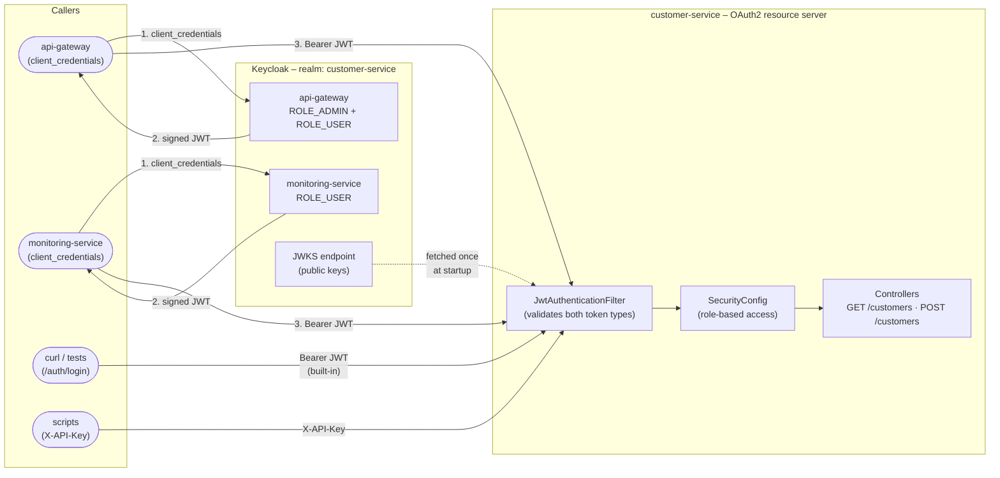

# API Reference

> Back to [README](../README.md)

## Table of contents

- [Authentication](#authentication)
- [Customer endpoints](#customer-endpoints)
- [Operational endpoints](#operational-endpoints-no-auth)
- [Security demos](#security-demos)

---

## Authentication

All endpoints except `/auth/login`, `/auth/refresh`, `/actuator/**`, and `/demo/**` require a Bearer token.

Two auth modes coexist in the same filter chain:



```bash
# Login
curl -s -X POST http://localhost:8080/auth/login \
  -H 'Content-Type: application/json' \
  -d '{"username":"admin","password":"admin"}'
# → {"token":"eyJhbGci..."}

export TOKEN=<token>

# Refresh (extend session without re-login)
curl -s -X POST http://localhost:8080/auth/refresh \
  -H "Authorization: Bearer $TOKEN"
# → {"token":"eyJhbGci..."} (new token, fresh 24h expiry)

# API key auth (M2M, no login needed)
curl -s http://localhost:8080/customers -H "X-API-Key: demo-api-key-2026"
```

---

## Customer endpoints

```bash
# List all customers (paginated, with Link headers)
curl -s http://localhost:8080/customers -H "Authorization: Bearer $TOKEN"

# Search by name or email
curl -s "http://localhost:8080/customers?search=alice" -H "Authorization: Bearer $TOKEN"

# List — API v2 (adds createdAt field + Deprecation header on v1)
curl -s http://localhost:8080/customers \
  -H "Authorization: Bearer $TOKEN" -H "X-API-Version: 2.0"

# Get single customer
curl -s http://localhost:8080/customers/1 -H "Authorization: Bearer $TOKEN"

# Create (ROLE_ADMIN required)
curl -s -X POST http://localhost:8080/customers \
  -H "Authorization: Bearer $TOKEN" -H 'Content-Type: application/json' \
  -d '{"name":"Alice","email":"alice@example.com"}'

# Update
curl -s -X PUT http://localhost:8080/customers/1 \
  -H "Authorization: Bearer $TOKEN" -H 'Content-Type: application/json' \
  -d '{"name":"Alice Updated","email":"alice-new@example.com"}'

# Delete
curl -s -X DELETE http://localhost:8080/customers/1 -H "Authorization: Bearer $TOKEN"

# Batch import
curl -s -X POST http://localhost:8080/customers/batch \
  -H "Authorization: Bearer $TOKEN" -H 'Content-Type: application/json' \
  -d '[{"name":"A","email":"a@x.com"},{"name":"B","email":"b@x.com"}]'

# Cursor-based pagination
curl -s "http://localhost:8080/customers/cursor?cursor=0&size=10" -H "Authorization: Bearer $TOKEN"

# CSV export
curl -s http://localhost:8080/customers/export -H "Authorization: Bearer $TOKEN" -o customers.csv

# Idempotent create
curl -s -X POST http://localhost:8080/customers \
  -H "Authorization: Bearer $TOKEN" -H 'Content-Type: application/json' \
  -H 'Idempotency-Key: req-001' \
  -d '{"name":"Alice","email":"alice@example.com"}'

# 10 most recent customers (Redis ring buffer)
curl -s http://localhost:8080/customers/recent -H "Authorization: Bearer $TOKEN"

# Aggregate (200 ms intentional latency — parallel virtual threads)
curl -s http://localhost:8080/customers/aggregate -H "Authorization: Bearer $TOKEN"

# Enrich via Kafka request-reply (blocks up to 5 s)
curl -s http://localhost:8080/customers/1/enrich -H "Authorization: Bearer $TOKEN"

# Slow query simulation (observability demo)
curl -s "http://localhost:8080/customers/slow-query?seconds=2" -H "Authorization: Bearer $TOKEN"
```

---

## Operational endpoints (no auth)

```bash
curl -s http://localhost:8080/actuator/health
curl -s http://localhost:8080/actuator/health/readiness
curl -s http://localhost:8080/actuator/health/liveness
curl -s http://localhost:8080/actuator/prometheus | grep 'http_server_requests\|customer'
```

---

## Security demos

```bash
# SQL injection — vulnerable vs safe
curl "http://localhost:8080/demo/security/sqli-vulnerable?name=Alice'%20OR%20'1'='1"
curl "http://localhost:8080/demo/security/sqli-safe?name=Alice"

# XSS — vulnerable vs safe
curl "http://localhost:8080/demo/security/xss-vulnerable?name=<script>alert(1)</script>"
curl "http://localhost:8080/demo/security/xss-safe?name=<script>alert(1)</script>"

# CORS misconfiguration info
curl http://localhost:8080/demo/security/cors-info
```
