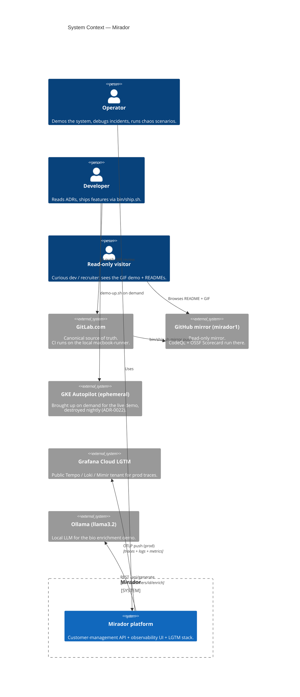
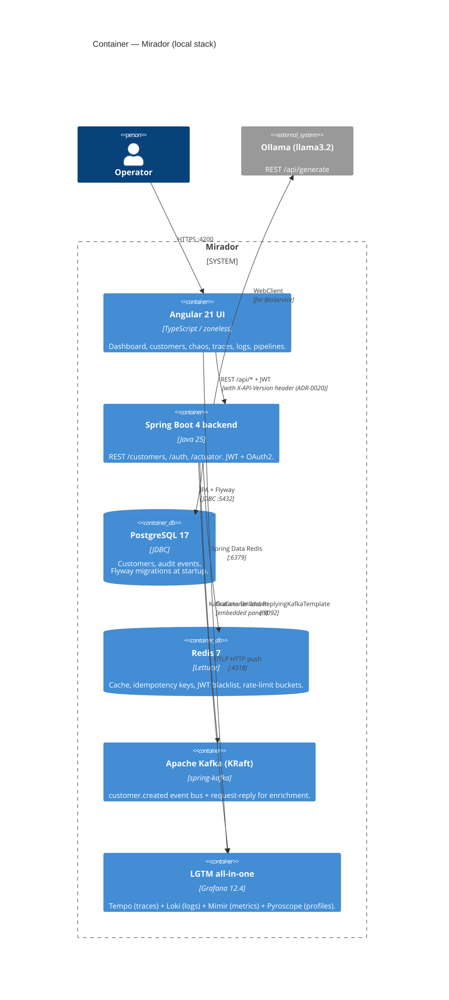
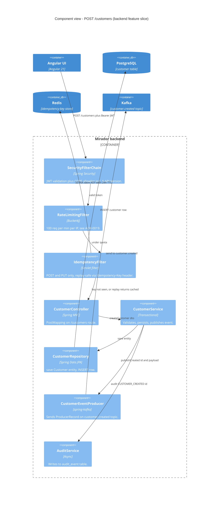

# C4 architecture diagrams

A four-level [C4](https://c4model.com/) view of Mirador, rendered as
Mermaid so the diagrams live next to the code and version with it.

GitHub + GitLab both render Mermaid blocks inline — open this file on
either platform and the diagrams paint themselves.

> **Reading order**: System Context → Container → Component → Code.
> Each level zooms in by ~10×.

---

## Level 1 — System Context

Where Mirador sits in the world. Who calls it, what it depends on.

---

## Level 2 — Container

Inside Mirador: which processes / services exist, how they talk.

---

## Level 3 — Component (backend slice)

One feature slice — `customer.create` — from controller to event bus.

---

## Level 4 — Code (zoom)

For the deepest level we don't draw a Mermaid diagram — Compodoc
(UI side) and Javadoc (backend side) generate the per-class
reference automatically:

- Backend Javadoc: `mvn javadoc:javadoc` → `target/site/apidocs/`
- UI Compodoc: `npm run compodoc` → `docs/compodoc/`
- Compose: `compodoc` container at <http://localhost:9995> serves
  the UI's documentation when `--profile full` is used.

---

## Maintenance rule

These diagrams stay accurate by being **one-step-removed from the
code** — they describe SHAPES, not file paths. When a new container
appears (e.g. another LLM provider next to Ollama), update Level 2.
When a new component runs in a feature slice (e.g. SagaOrchestrator
on POST), update Level 3. **Do not add diagrams below Level 3** —
the code itself is Level 4.

If you add a new microservice or split Mirador, add Level 1 and 2
boxes for it; preserve the existing slice in Level 3 by renaming the
container boundary to the new service name.
