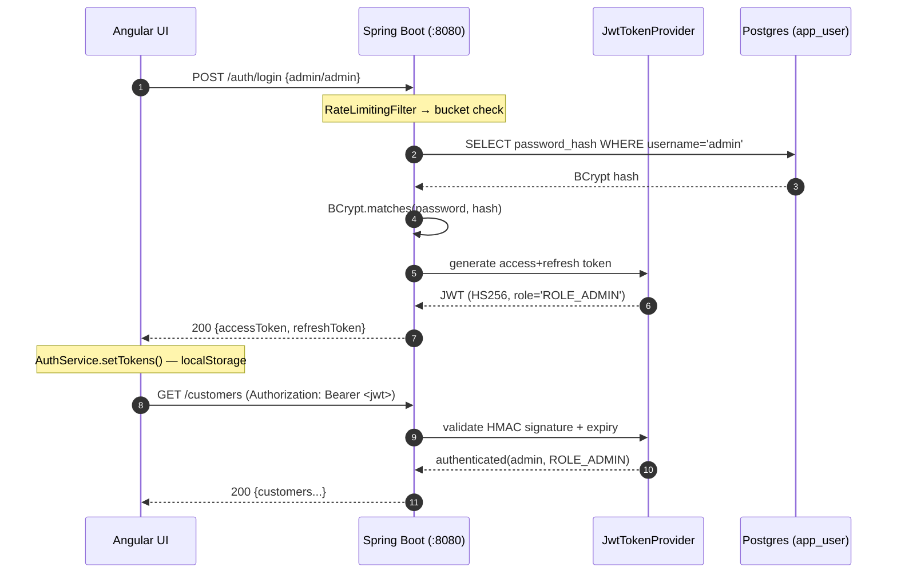
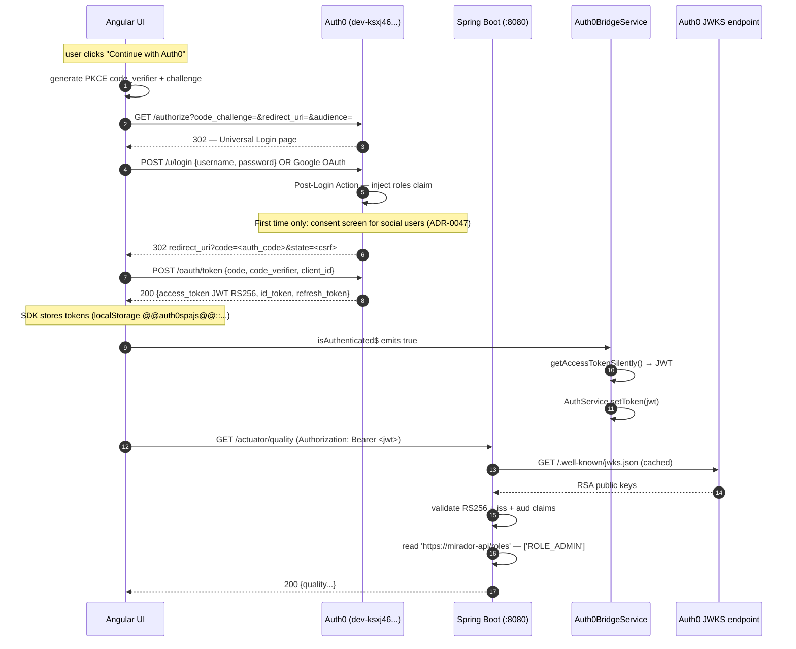

# Security

> Back to [README](../README.md)

## Table of contents

- [Authentication flows](#authentication-flows)
  - [Built-in JWT](#flow-1--built-in-jwt-adminadmin)
  - [Auth0 OIDC + PKCE](#flow-2--auth0-oidc--pkce)
- [Implemented patterns](#implemented-patterns)
- [Demo scenarios](#demo-scenarios)
  - [SQL injection](#scenario-a--sql-injection-owasp-a03)
  - [Brute-force attack](#scenario-b--brute-force-attack)
  - [XSS attack](#scenario-c--xss-attack)
  - [Dependency vulnerability scan](#scenario-d--dependency-vulnerability-scan)
- [OWASP headers](#owasp-security-headers)

---

## Authentication flows

Mirador supports **three authentication providers in parallel** via a single
Spring Security filter chain. The UI offers a choice between them, and the
backend validates all three shapes through
[`JwtAuthenticationFilter`](../../src/main/java/com/mirador/auth/JwtAuthenticationFilter.java):

| Provider | Token signature | Issuer | Role source |
|---|---|---|---|
| Built-in | HMAC-SHA256 | self (`JwtTokenProvider`) | `role` claim (single) |
| Keycloak | RS256 (JWKS) | `$KEYCLOAK_URL/realms/customer-service` | `realm_access.roles` (array) |
| Auth0 | RS256 (JWKS) | `https://$AUTH0_DOMAIN/` | `https://mirador-api/roles` (array, injected by a Post-Login Action — see [`docs/api/auth0-action-roles.js`](../api/auth0-action-roles.js)) |

Read the corresponding ADRs for the rationale:
[ADR-0018](../adr/0018-jwt-strategy-hmac-refresh-rotation.md) (built-in JWT),
[ADR-0047](../adr/0047-auth0-consent-for-social-logins.md) (Auth0 consent trade-off).

### Flow 1 — Built-in JWT (admin/admin)

Used for development convenience and the default demo login form. No external
IDP, credentials stored in an H2/PostgreSQL `app_user` table, tokens signed
with a shared HMAC secret.



### Flow 2 — Auth0 OIDC + PKCE

Used in the production demo. The UI uses `@auth0/auth0-angular` (2.x) which
implements the OAuth2 Authorization Code flow with PKCE (RFC 7636) —
browser-safe because no client secret is needed.



#### Interceptor fallback — race condition handling

On the first request right after an Auth0 callback, the UI's
[`authInterceptor`](../../../mirador-ui/src/app/core/auth/auth.interceptor.ts)
might catch a 401 because `AuthService` doesn't yet have the token (Auth0
SDK is still processing the `?code` callback). The interceptor then waits
for `Auth0Service.isLoading$ = false`, fetches a fresh access token via
`getAccessTokenSilently()`, and replays the original request with the
`X-Auth0-Retry: 1` header set so a second 401 on the retry doesn't loop.
See the per-phase 401 / 403 matrix in the interceptor header comment.

---

## Implemented patterns

| Pattern | What it illustrates | Where |
|---|---|---|
| OWASP security headers | CSP, X-Frame-Options, nosniff, Referrer-Policy, Permissions-Policy | `auth/SecurityHeadersFilter` |
| Input sanitization | `@Size(max=255)` on DTOs, request body limit (1 MB) | `customer/CreateCustomerRequest`, `application.yml` |
| Brute-force protection | IP lockout after 5 failed login attempts (15 min) | `auth/LoginAttemptService` |
| JWT refresh | `POST /auth/refresh` — extend session without re-login | `auth/AuthController` |
| Audit logging | Async DB writes to `audit_event` table — who, what, when, IP | `observability/AuditService`, `V4__create_audit_event.sql` |
| API key (M2M) | `X-API-Key` header for machine-to-machine calls without JWT | `auth/ApiKeyAuthenticationFilter` |
| API deprecation | `Deprecation` + `Sunset` headers on v1 endpoints | `customer/CustomerController` |
| SQL injection demo | Vulnerable string concatenation vs parameterized query | `customer/SecurityDemoController` |
| XSS demo | Reflected input vs HTML-encoded output | `customer/SecurityDemoController` |
| CORS info | Explains `allowedOrigins("*")` + credentials risk | `customer/SecurityDemoController` |
| JWT hardening | `iss` / `aud` claims validated to prevent cross-service token reuse | `auth/JwtTokenProvider` |
| Actuator hardening | `env`/`configprops` disabled; health details require auth; only `health`, `info`, `prometheus` are public | `application.yml`, `auth/SecurityConfig` |
| Input validation on auth | `@NotBlank` + `@Size` on login request DTOs | `auth/AuthController` |
| Find Security Bugs (SAST) | SpotBugs plugin detecting 130+ OWASP vulnerability patterns | `pom.xml` |
| OWASP Dependency-Check (SCA) | Maven plugin scans for known CVEs in dependencies; CI job in pipeline | `pom.xml`, `.gitlab-ci.yml`, `run.sh security-check` |

---

## Demo scenarios

### Scenario A — SQL injection (OWASP A03)

```bash
# Vulnerable: string concatenation → dumps all customers
curl "http://localhost:8080/demo/security/sqli-vulnerable?name=Alice'%20OR%20'1'='1"

# Safe: parameterized query → returns only exact matches
curl "http://localhost:8080/demo/security/sqli-safe?name=Alice"
```

### Scenario B — Brute-force attack

```bash
# After 5 failed attempts, the IP is locked out for 15 minutes
for i in $(seq 1 6); do
  curl -s -X POST http://localhost:8080/auth/login \
    -H 'Content-Type: application/json' \
    -d '{"username":"admin","password":"wrong"}' | jq .
done
# → 6th attempt returns HTTP 429 with retryAfterMinutes: 15
```

### Scenario C — XSS attack

```bash
# Vulnerable: script tag is reflected as HTML
curl "http://localhost:8080/demo/security/xss-vulnerable?name=<script>alert('XSS')</script>"

# Safe: HTML-encoded output
curl "http://localhost:8080/demo/security/xss-safe?name=<script>alert('XSS')</script>"
```

### Scenario D — Dependency vulnerability scan

```bash
./run.sh security-check
# → Report at target/dependency-check-report.html
```

---

## OWASP security headers

`SecurityHeadersFilter` adds these headers to every response:

| Header | Value | Protection |
|---|---|---|
| `X-Content-Type-Options` | `nosniff` | MIME-type sniffing |
| `X-Frame-Options` | `DENY` | Clickjacking |
| `X-XSS-Protection` | `0` | Disables broken legacy XSS filter |
| `Referrer-Policy` | `strict-origin-when-cross-origin` | URL leakage in Referer header |
| `Content-Security-Policy` | `default-src 'self'; frame-ancestors 'none'` | XSS, data injection |
| `Permissions-Policy` | `camera=(), microphone=(), geolocation=()` | Sensitive browser APIs |

CSP is skipped for Swagger UI endpoints (`/swagger-ui/**`, `/v3/api-docs/**`) which require inline scripts.
